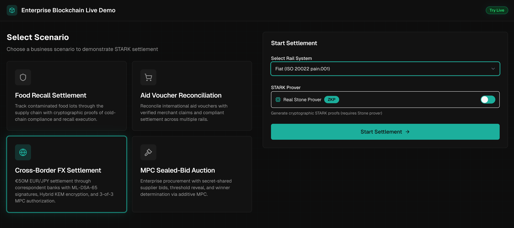
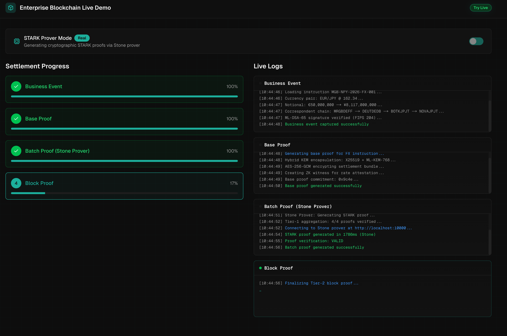
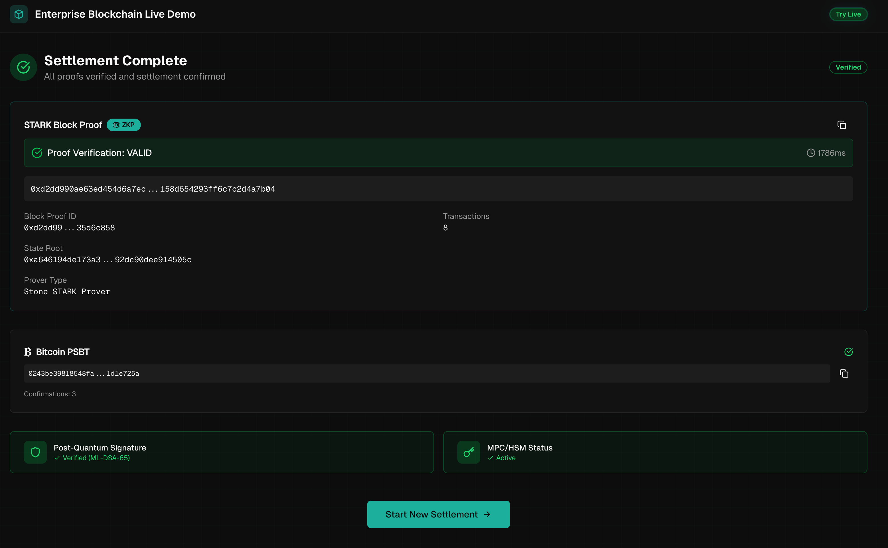

# Enterprise Blockchain Demo

Interactive demonstration of STARK-based settlement with recursive proof aggregation, post-quantum cryptography, and multi-rail settlement.

## Screenshots

### 1. Scenario Selection

Select from 4 enterprise scenarios and choose your settlement rail (Solana, Bitcoin, or Fiat).



### 2. Live Proof Generation

Watch real-time STARK proof aggregation with step-by-step progress and live logs.



### 3. Settlement Results

View the final block proof, rail confirmation, and security verification status.



## Quick Start (Mock Mode)

```bash
# Install dependencies
npm install

# Start development server (mock prover)
npm run dev
```

Open [http://localhost:3000](http://localhost:3000) to view the demo.

## Full Infrastructure Mode

For production-like demonstration with real STARK proof generation:

```bash
# First time build (30-45 minutes for Stone prover)
npm run docker:full:build

# Start all services
npm run docker:full

# View logs
npm run docker:full:logs

# Stop services
npm run docker:full:down
```

### Resource Requirements

| Resource | Minimum  | Recommended |
| -------- | -------- | ----------- |
| RAM      | 16 GB    | 32 GB       |
| CPU      | 4 cores  | 8 cores     |
| Disk     | 10 GB    | 20 GB       |
| Network  | Required | Required    |

## Scenarios

### 1. Food Recall Settlement

Track contaminated food lots through the supply chain with cryptographic proofs of cold-chain compliance and recall execution.

- **Business Context**: Green Valley Farms spinach contamination
- **Key Features**: Cold-chain telemetry, lot tracing, distribution center flagging
- **Proof Type**: 3-tier recursive STARK aggregation

### 2. Aid Voucher Reconciliation

Reconcile international aid vouchers with verified merchant claims and compliant settlement across multiple rails.

- **Business Context**: GRANT-9001 redemption processing
- **Key Features**: Claim validation, duplicate detection, compliance checks
- **Proof Type**: 3-tier recursive STARK aggregation

### 3. Cross-Border FX Settlement

€50M EUR/JPY settlement through correspondent banks with ML-DSA-65 signatures, Hybrid KEM encryption, and 3-of-3 MPC authorization.

- **Business Context**: Leet Gaming Global Bank → Leet Gaming Settlement Corp
- **Key Features**:
  - ML-DSA-65 post-quantum signatures (NIST FIPS 204)
  - Hybrid KEM encryption (X25519 + ML-KEM-768, FIPS 203)
  - 3-of-3 MPC settlement authorization
  - ISO 20022 pain.001 message generation
- **Correspondent Chain**: MRGBDEFF → DEUTDEDB → BOTKJPJT → NOVAJPJT

### 4. MPC Sealed-Bid Auction

Enterprise procurement with secret-shared supplier bids, threshold reveal, and winner determination via additive MPC.

- **Business Context**: Industrial Steel Alloy Grade 316L procurement
- **Bidders**: Nordic Steel, Baltic Alloys, Rhine Components
- **Key Features**:
  - SHA-256 bid commitments
  - 3-of-3 additive secret sharing
  - Threshold reveal protocol
  - Winner determination with proof

## Settlement Rails

| Rail        | Protocol                    | Use Case                                |
| ----------- | --------------------------- | --------------------------------------- |
| **Solana**  | VersionedTransaction + Memo | Fast finality, proof commitment         |
| **Bitcoin** | PSBT + OP_RETURN            | Settlement anchoring, immutability      |
| **Fiat**    | ISO 20022 pain.001          | Bank integration, regulatory compliance |

## Architecture

```
┌─────────────────────────────────────────────────────────┐
│                    Demo Frontend                         │
│                   (Next.js + React)                      │
├─────────────────────────────────────────────────────────┤
│                      API Layer                           │
│            (SSE Streaming + Session Mgmt)                │
├─────────────────────────────────────────────────────────┤
│                 Settlement Services                      │
│    ┌─────────────┐  ┌────���────────┐  ┌─────────────┐   │
│    │Mock Prover  │  │Stone Prover │  │Real Prover  │   │
│    │  (Fast)     │  │  (Docker)   │  │  (gRPC)     │   │
│    └─────────────┘  └─────────────┘  └─────────────┘   │
├─────────────────────────────────────────────────────────┤
│                   Rail Adapters                          │
│    ┌───��─────────┐  ┌─────────────┐  ┌─────────────┐   │
│    │   Solana    │  │   Bitcoin   │  │    Fiat     │   │
│    │   Devnet    │  │   Testnet   │  │ ISO 20022   │   │
│    └─────────────┘  └─────────────┘  └─────────────┘   │
└──��──────────────────────────────────────────────────────┘
```

## Proof Aggregation Pipeline

```
Base Proofs (per transaction)
       │
       ▼
  ┌─────────┐
  │ Tier-1  │  128 → 1 aggregation
  │  Batch  │
  └────┬────┘
       │
       ▼
  ┌─��───────┐
  │ Tier-2  │  64 → 1 aggregation
  │  Block  │
  └────┬────┘
       │
       ▼
   Block Proof
   (Settlement)
```

## Full Stack Services

When running in full infrastructure mode:

| Service      | URL                    | Purpose                |
| ------------ | ---------------------- | ---------------------- |
| Demo App     | http://localhost:3000  | Main interface         |
| Jaeger       | http://localhost:16686 | Distributed tracing    |
| Prometheus   | http://localhost:9090  | Metrics & alerts       |
| Besu RPC     | http://localhost:8545  | Local EVM              |
| Stone Prover | http://localhost:10000 | STARK proof generation |

## Development

### Project Structure

```
demo/
├── app/                    # Next.js App Router
│   ├── api/               # API routes (settlement, events)
│   ├── page.tsx           # Dashboard
│   ├── progress/          # Settlement progress
│   └── results/           # Settlement results
├── components/            # React components
│   ├── dashboard/         # Scenario cards, controls
│   ├── layout/            # Container, navbar
│   ├── progress/          # Step flow, logs
│   └── ui/                # Shadcn components
├── services/              # Business logic
│   ├─�� mock-settlement.ts # Mock prover flow
│   ├── real-prover-settlement.ts
│   ├── solana-adapter.ts  # Solana Devnet
│   └── bitcoin-adapter.ts # Bitcoin Testnet
├── e2e/                   # Playwright tests
├── docker-compose.yml     # Dev stack (mock)
└── docker-compose.full.yml # Full stack (real)
```

### Available Scripts

```bash
# Development
npm run dev              # Start dev server
npm run dev:full         # Dev with Docker prover
npm run build            # Production build
npm run lint             # ESLint

# Testing
npm run test             # Vitest unit tests
npm run test:run         # Vitest (CI mode)
npm run test:e2e         # Playwright E2E tests
npm run test:e2e:ui      # Playwright UI mode
npm run test:e2e:prover  # E2E with real prover

# Docker (Mock Stack)
npm run docker:up        # Start mock stack
npm run docker:down      # Stop mock stack
npm run docker:logs      # View logs

# Docker (Full Stack)
npm run docker:full:build  # Build full stack
npm run docker:full        # Start full stack
npm run docker:full:down   # Stop full stack
npm run docker:full:logs   # View logs
npm run test:e2e:full      # E2E with full stack
```

## Testing

### Unit Tests (Vitest)

```bash
npm run test:run
```

### E2E Tests (Playwright)

Full browser-based tests covering all 4 scenarios:

```bash
# Run all E2E tests
npm run test:e2e

# Run specific test file
npm run test:e2e -- e2e/scenarios.spec.ts

# Run in headed mode
npm run test:e2e:headed

# Run with Playwright UI
npm run test:e2e:ui
```

### Proof Reports

When running with real prover, reports are generated in `e2e-results/proofs/`:

```json
{
  "proofId": "0x...",
  "stateRoot": "0x...",
  "proverLatencyMs": 1234,
  "verificationResult": "VALID",
  "proverType": "stone"
}
```

## Troubleshooting

### Stone Prover Build Fails

The Stone prover requires significant resources:

```bash
# Check Docker memory (should be 8GB+)
docker system info | grep Memory

# On macOS, increase in Docker Desktop:
# Preferences → Resources → Memory → 8GB+
```

### Rate Limiting in Tests

E2E tests may hit rate limits. The limit is higher in CI/development:

```bash
CI=true npm run test:e2e
```

### Port Conflicts

```bash
# Check what's using port 3000
lsof -i :3000

# Use different port
PORT=3001 npm run dev
```

### Real Prover Connection Issues

```bash
# Check prover health
curl http://localhost:10000/health

# View prover logs
npm run docker:full:logs -- stone-prover
```

## Security

- HMAC-signed session tokens
- Rate limiting (10 req/min production, 100 req/min dev)
- CSRF protection via origin validation
- Input validation with Zod schemas
- No secrets in frontend

## External Dependencies

| Service         | Network                              | Cost |
| --------------- | ------------------------------------ | ---- |
| Solana Devnet   | https://api.devnet.solana.com        | Free |
| Bitcoin Testnet | https://blockstream.info/testnet/api | Free |

### Getting Testnet Tokens

- **Solana**: https://faucet.solana.com/
- **Bitcoin**: https://bitcoinfaucet.uo1.net/

## Tech Stack

- **Framework**: Next.js 16 (App Router)
- **UI**: React 19, Tailwind CSS 4, Lucide Icons
- **Testing**: Vitest, React Testing Library, Playwright
- **Validation**: Zod
- **Prover**: Stone STARK Prover (Docker)
- **Observability**: OpenTelemetry, Jaeger, Prometheus

## License

See [LICENSE](../LICENSE) in the repository root.
