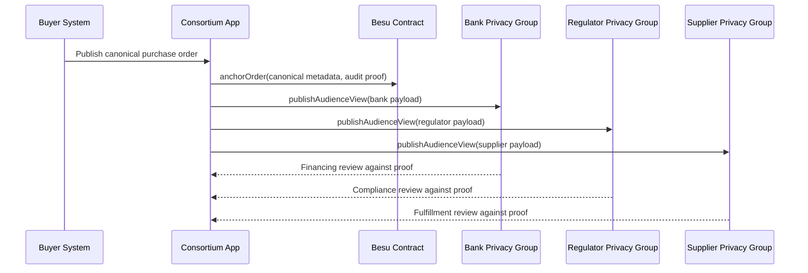

# Besu Order Sharing Flow

This document shows how the consortium order-sharing scenario maps to a Besu privacy-group workflow.

## Key Study Points

- A single canonical record can support multiple audience-specific payloads.
- Privacy groups keep non-essential fields away from other participants.
- Audit proofs preserve linkage between the partial view and the canonical order.