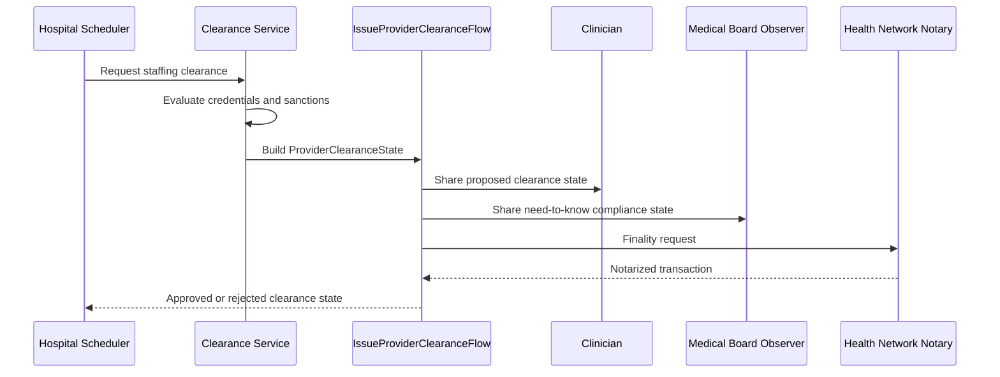

# Corda Clearance Flow

This document shows how the staffing clearance scenario maps to a Corda-style state and flow model.

## Key Study Points

- Parties receive the state because they are involved, not because the network broadly replicates all data.
- Approval and rejection are modeled as explicit contract commands.
- A notary provides uniqueness and finality without broadcasting everything to all members.