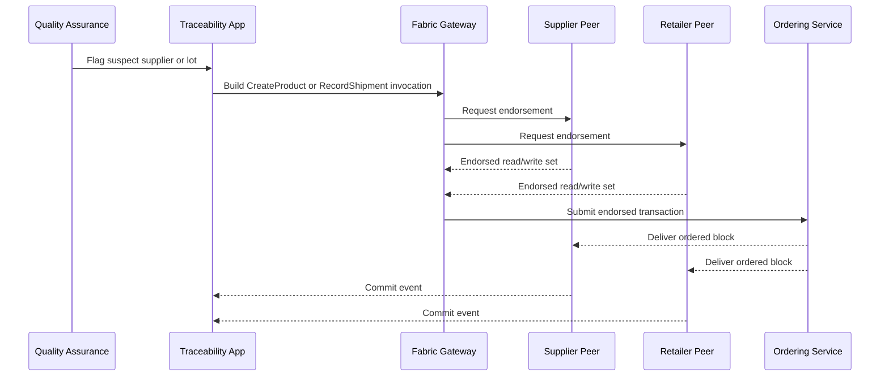

# Fabric Traceability Flow

This document shows how the food recall scenario maps to a Fabric-style transaction flow.

## Key Study Points

- Endorsement rules represent real organizational approval boundaries.
- Telemetry can be carried as transient data when it should not be fully replicated.
- Immediate finality makes recall scoping operationally practical.