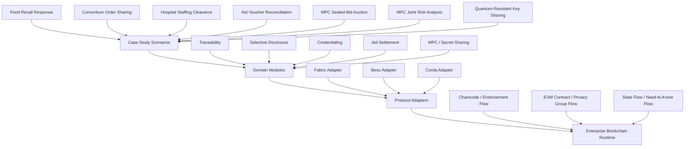

# Architecture Overview

This repository separates business-domain logic from blockchain-protocol concerns.

## Layering

## Design Rationale

- Domain modules stay readable and easy to test.
- Protocol adapters make platform assumptions explicit instead of leaking them into business rules.
- Examples remain useful before a team commits to a specific blockchain runtime.

## Reading Path

- Start with the scenario in `examples/`.
- Inspect the corresponding domain logic in `modules/`.
- For ledger-bound scenarios, review the protocol adapter to see how the domain event maps to Fabric, Besu, or Corda.
- For MPC and key management scenarios, see `docs/architecture/mpc-quantum-resistance.md`; these examples are intentionally off-chain.
- Use the platform decision matrix to discuss deployment tradeoffs.
