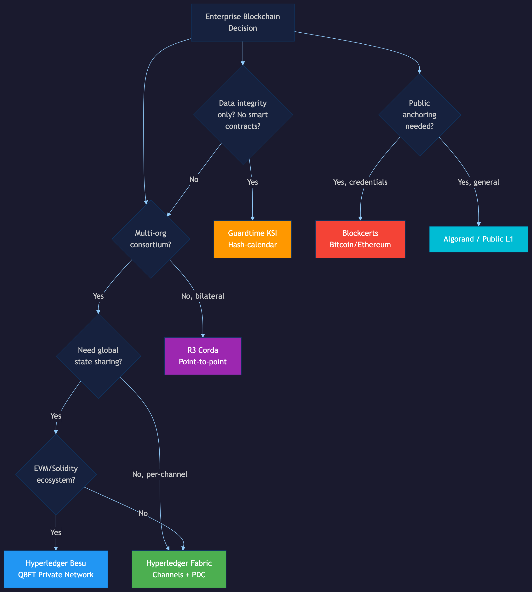
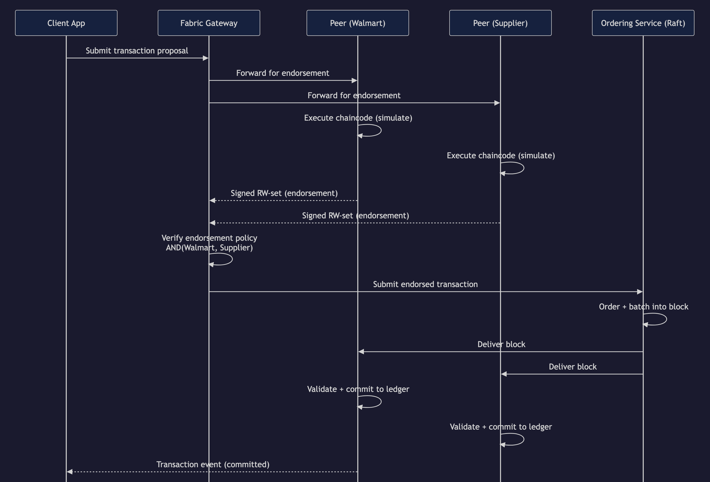
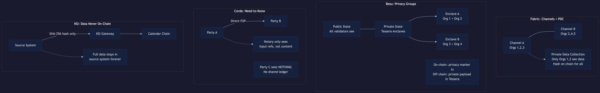
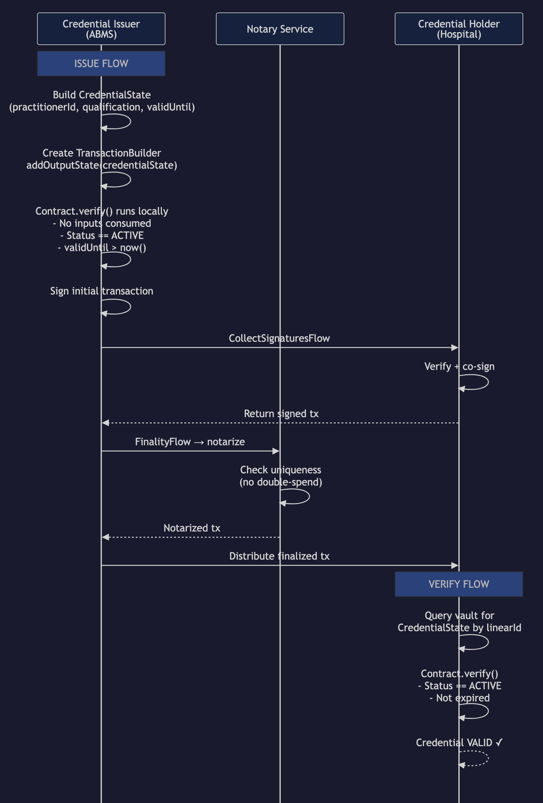
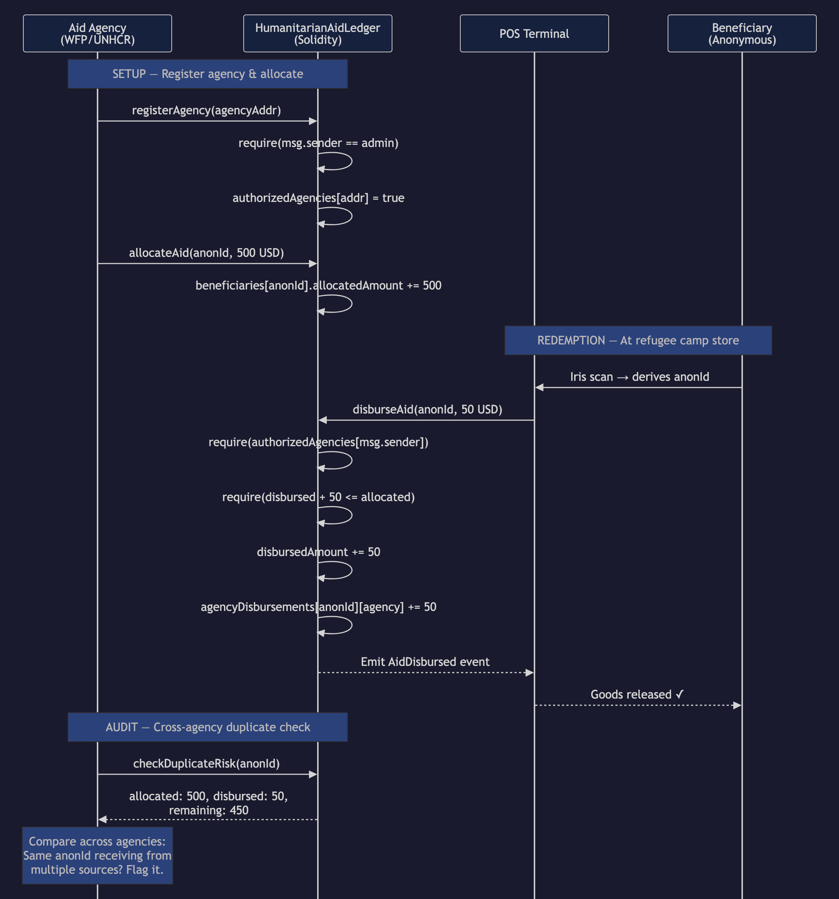
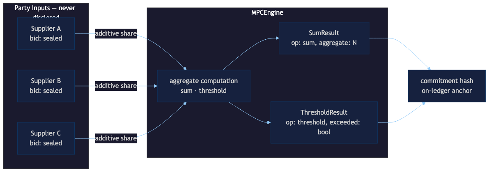
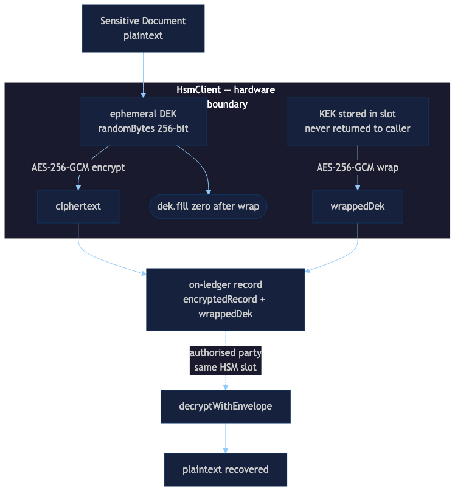
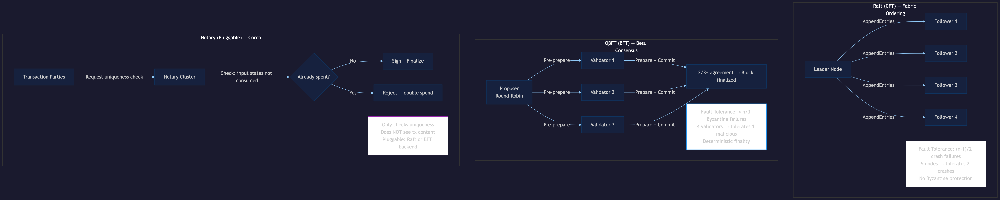
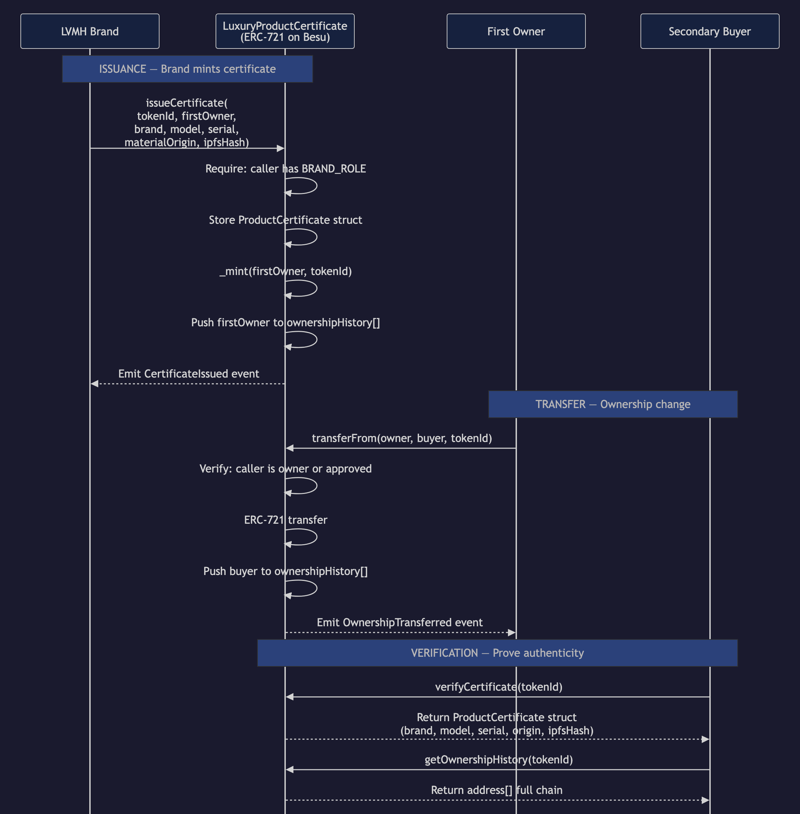
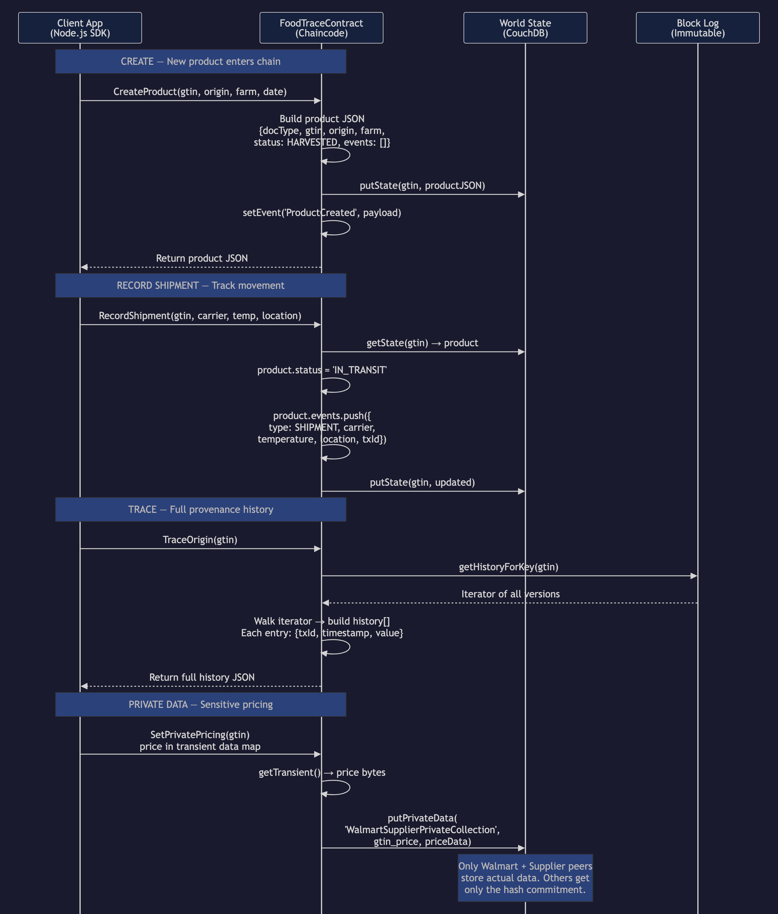

<!-- _class: lead -->

# Enterprise Blockchain Case Studies

TypeScript repository demonstrating enterprise blockchain patterns.

**Focus areas**

- Operational case studies (traceability, privacy, credentials, settlement)
- Protocol adapters (Fabric, Besu, Corda)
- Off-chain cryptography (MPC, HSM, post-quantum)

---

# Repository Structure

| Folder       | Contents                                                  |
| ------------ | --------------------------------------------------------- |
| `modules/`   | Domain logic, protocol adapters, integration clients      |
| `examples/`  | 21 runnable scenarios                                     |
| `contracts/` | Solidity (Foundry), Fabric chaincode (TS), Corda (Kotlin) |
| `docs/`      | Architecture guides, ADRs, this deck                      |
| `skills/`    | AI skill files for assisted development                   |
| `tests/`     | Property-based tests (fast-check)                         |

---

<!-- _class: compact -->

# Case Studies

| Scenario           | Domain Problem                                   | Protocol Fit               |
| ------------------ | ------------------------------------------------ | -------------------------- |
| Food recall        | Trace contaminated lots across supply chain      | Fabric (channel isolation) |
| Order sharing      | Selective disclosure to bank/logistics/regulator | Besu (privacy groups)      |
| Staffing clearance | Verify credentials before clinical assignment    | Corda (point-to-point)     |
| Aid reconciliation | Multi-agency voucher settlement                  | Besu (shared state)        |

---

<!-- _class: compact -->



# Platform Selection

Decision tree for protocol choice:

- Data integrity only → **KSI / Guardtime**
- Public anchoring → **Bitcoin / Ethereum**
- Bilateral flows → **Corda**
- EVM ecosystem → **Besu**
- Channel isolation → **Fabric**

---

<!-- _class: compact -->



# Fabric: Endorsement Flow

1. Client submits proposal
2. Endorsing peers simulate chaincode
3. Client collects endorsements
4. Orderer batches into block
5. All peers validate and commit

Use case: **Food recall traceability**

---

<!-- _class: compact -->



# Privacy Patterns

| Platform | Mechanism                                 |
| -------- | ----------------------------------------- |
| Fabric   | Private data collections, transient data  |
| Besu     | Privacy groups, restricted contract state |
| Corda    | Need-to-know state distribution           |

Use case: **Consortium order sharing**

---

<!-- _class: compact -->



# Corda: Flow Protocol

1. Issuer builds `CredentialState`
2. Contract verifies locally
3. `CollectSignaturesFlow` gathers counterparty signatures
4. Notary checks uniqueness
5. `FinalityFlow` distributes to participants

Use case: **Hospital staffing clearance**

---

<!-- _class: compact -->



# Settlement Controls

- Agency registers and allocates funds
- Beneficiary redeems at POS
- Contract enforces budget limits
- Cross-agency duplicate detection

Use case: **Aid voucher reconciliation**

---

<!-- _class: compact -->



# MPC: Additive Secret Sharing

Parties split inputs into additive shares:

```
secret = share₁ + share₂ + share₃ (mod p)
```

Computation happens on shares; result reconstructed.

Examples: `mpc-sealed-bid-auction`, `mpc-joint-risk-analysis`

---

<!-- _class: compact -->

# MPC: Threshold Schemes

**Shamir Secret Sharing (k-of-n)**

- Polynomial interpolation over finite field
- Any k shares reconstruct; k-1 reveal nothing
- Used for key custody and quorum authorization

Example: `quantum-resistant-key-sharing` — 3-of-5 threshold + hash-ladder anchoring

---

<!-- _class: compact -->



# HSM: Envelope Encryption

1. Generate ephemeral DEK (256-bit)
2. Encrypt payload with DEK (AES-GCM)
3. Wrap DEK with KEK inside HSM
4. Store `ciphertext + wrappedDEK`
5. Only HSM can unwrap

Private keys never leave hardware boundary.

---

<!-- _class: compact -->

# HSM Examples

| Example                   | Pattern                                        |
| ------------------------- | ---------------------------------------------- |
| `hsm-transaction-signing` | EC P-256 ECDSA with audit digest               |
| `hsm-key-ceremony`        | 3-of-5 Shamir + HSM-signed root certificate    |
| `hsm-envelope-encryption` | DEK/KEK for on-ledger document confidentiality |

---

<!-- _class: compact -->

# Post-Quantum Cryptography

**NIST Standards (August 2024)**

| Standard | Algorithm  | Wire Sizes                       |
| -------- | ---------- | -------------------------------- |
| FIPS 203 | ML-KEM-768 | pk: 1184 B, ct: 1088 B, ss: 32 B |
| FIPS 204 | ML-DSA-65  | pk: 1952 B, sig: 3309 B          |

Replaces RSA/ECDH (key exchange) and ECDSA (signatures).

---

<!-- _class: compact -->

# ML-KEM Key Encapsulation

**Lattice-based KEM (FIPS 203)**

1. Recipient generates `(pk, sk)`
2. Sender: `(ciphertext, sharedSecret) = encapsulate(pk)`
3. Recipient: `sharedSecret = decapsulate(sk, ciphertext)`

Parameter sets: ML-KEM-512, ML-KEM-768, ML-KEM-1024

Example: `kyber-kem-key-exchange`

---

<!-- _class: compact -->

# Hybrid KEM

**X25519 + ML-KEM-768**

```
combinedSecret = HKDF(x25519Secret || mlkemSecret)
```

- Defense-in-depth: secure if either primitive holds
- Recommended for transition period
- Backward compatible with classical peers

Example: `hybrid-kem-settlement`

---

<!-- _class: compact -->

# Quantum-Safe Payment Flow

| Phase                | Primitive                        |
| -------------------- | -------------------------------- |
| Key ceremony         | Hybrid KEM (X25519 + ML-KEM-768) |
| Sign instruction     | ML-DSA-65 (FIPS 204)             |
| Encrypt payload      | AES-256-GCM with hybrid key      |
| Authorize settlement | 3-of-3 MPC threshold             |

Example: `quantum-safe-payment`

---

<!-- _class: compact -->

# STARK Settlement Layer

**Recursive Proof Aggregation**

| Tier   | Aggregation | Purpose                    |
| ------ | ----------- | -------------------------- |
| Base   | 1:1         | Per-transaction proof      |
| Tier-1 | N:1         | Batch aggregation          |
| Tier-2 | M:1         | Block proof for settlement |

Multi-rail settlement: Solana, Bitcoin, fiat (ISO 20022)

Example: `stark-cross-border-settlement`

---

<!-- _class: compact -->



# Consensus Comparison

| Protocol | Consensus                 | Finality  |
| -------- | ------------------------- | --------- |
| Fabric   | Raft / BFT                | Immediate |
| Besu     | QBFT / IBFT 2.0           | Immediate |
| Corda    | Notary (single/clustered) | Immediate |

All provide deterministic finality (no forks).

---

<!-- _class: compact -->

# Architecture Layers

| Layer       | Responsibility              | Location                |
| ----------- | --------------------------- | ----------------------- |
| Domain      | Business rules, entities    | `modules/{domain}/`     |
| Protocol    | Platform-specific tx shapes | `modules/protocols/`    |
| Integration | SDK bindings, retry, errors | `modules/integrations/` |
| Config      | Endpoints, credentials      | `examples/config/`      |

---

<!-- _class: compact -->



# Besu Integration

**Stack**: Solidity + ethers.js + privacy groups

Repository assets:

- `contracts/solidity/src/` — Foundry project
- `modules/integrations/besu-client/` — tx builders
- `modules/protocols/besu/` — privacy group calls

---

<!-- _class: compact -->

# Besu Dev Mode Configuration

**Docker Compose Settings**

| Setting          | Value                        |
| ---------------- | ---------------------------- |
| Image            | `hyperledger/besu:24.12.2`   |
| Network mode     | `--network=dev` (PoA mining) |
| Chain ID         | 1337                         |
| Block time       | ~1 second (dev mode)         |
| Validator-0 port | 8545                         |
| Validator-1 port | 8546                         |

Health check: TCP socket on RPC port (10s interval)

---

<!-- _class: compact -->

# Besu Command-Line Arguments

```yaml
command:
  - --network=dev # Dev mode with auto-mining
  - --rpc-http-enabled # Enable JSON-RPC HTTP
  - --rpc-http-host=0.0.0.0 # Bind to all interfaces
  - --rpc-http-cors-origins=http://localhost
  - --host-allowlist=localhost,127.0.0.1
  - --miner-enabled # Enable block production
  - --miner-coinbase=0x0000000000000000000000000000000000000000
```

Security: `no-new-privileges`, resource limits (1 CPU, 1GB)

---

<!-- _class: compact -->

# Besu Quick Start

```bash
# Start Besu validators
docker compose up -d besu-validator-0 besu-validator-1

# Wait for health checks (~20s)
docker compose ps

# Verify JSON-RPC
curl -X POST http://localhost:8545 \
  -H "Content-Type: application/json" \
  -d '{"jsonrpc":"2.0","method":"eth_blockNumber","params":[],"id":1}'

# Run E2E tests (15 tests against live nodes)
npm run test:e2e
```

---

<!-- _class: compact -->



# Fabric Integration

**Stack**: TypeScript chaincode + Gateway SDK

Repository assets:

- `contracts/fabric/` — FoodTraceContract
- `modules/integrations/fabric-gateway/` — proposal builders
- `modules/protocols/fabric/` — invoke/query shapes

---

<!-- _class: compact -->

# Corda Integration

**Stack**: Kotlin CorDapp + REST gateway

Repository assets:

- `contracts/corda/` — ProviderClearanceContract/Flow/State
- `modules/integrations/corda-gateway/` — HTTP request builders
- `modules/protocols/corda/` — flow invocation shapes

TypeScript handles the integration boundary, not CorDapp runtime.

---

# Quick Start

```bash
npm install          # install dependencies
npm run verify       # format + lint + typecheck + test + examples
make up              # start Docker Compose stack
make smoke           # run smoke tests
```

All examples run offline with mocked SDK boundaries.

---

<!-- _class: compact -->

# Infrastructure

**Local Development Stack**

| Service          | Port  | Purpose                |
| ---------------- | ----- | ---------------------- |
| Besu validator-0 | 8545  | Primary JSON-RPC       |
| Besu validator-1 | 8546  | Secondary validator    |
| Fabric peer      | 7051  | gRPC                   |
| OTEL Collector   | 4318  | Trace/metric ingestion |
| Jaeger           | 16686 | Distributed trace UI   |
| Prometheus       | 9090  | Metrics collection     |

Security: CIS Docker Benchmark (resource limits, no-new-privileges)

---

<!-- _class: compact -->

# Observability

**OpenTelemetry Integration**

```typescript
import { withSpan, createMeter } from "@enterprise-blockchain/shared";

const result = await withSpan("submitTransaction", async (span) => {
  span.setAttribute("channel", "food-trace");
  return gateway.submit(proposal);
});
```

- Automatic context propagation across services
- Traces exported to Jaeger, metrics to Prometheus
- Circuit breaker and retry instrumented

---

<!-- _class: compact -->

# Example Commands

| Category     | Commands                                                                                                              |
| ------------ | --------------------------------------------------------------------------------------------------------------------- |
| Case studies | `example:food-recall`, `example:order-sharing`, `example:staffing-clearance`, `example:aid-reconciliation`            |
| Protocol     | `example:fabric-projection`, `example:besu-projection`, `example:corda-projection`                                    |
| Integration  | `example:fabric-gateway`, `example:besu-ethers`, `example:corda-rest`                                                 |
| MPC          | `example:mpc-auction`, `example:mpc-risk-analysis`, `example:quantum-key-sharing`                                     |
| HSM          | `example:hsm-tx-signing`, `example:hsm-key-ceremony`, `example:hsm-envelope-encryption`                               |
| PQC          | `example:kyber-kem`, `example:hybrid-kem`, `example:quantum-safe-payment`, `example:quantum-safe-merkle-root-payment` |
| STARK        | `example:stark-settlement`                                                                                            |

---

# Property-Based Testing

**fast-check for Cryptographic Invariants**

| Module | Properties Tested                               |
| ------ | ----------------------------------------------- |
| HSM    | Envelope round-trip, ECDSA sign/verify          |
| Kyber  | ML-KEM encapsulate/decapsulate, implicit reject |
| MPC    | Field arithmetic, Shamir k-of-n reconstruction  |

```bash
npm test              # run all tests
npm test -- tests/hsm.property.test.ts
```

---

# Navigation

| Goal                       | Start                             |
| -------------------------- | --------------------------------- |
| Run a scenario             | `examples/`                       |
| Read domain logic          | `modules/{domain}/src/`           |
| See protocol shapes        | `modules/protocols/`              |
| Study integration patterns | `modules/integrations/`           |
| Review architecture        | `docs/architecture/`              |
| Set up Besu locally        | `docs/architecture/besu-setup.md` |
| Run infrastructure         | `make up && make smoke`           |
| Run E2E tests              | `npm run test:e2e`                |

---

<!-- _class: lead -->

# Summary

- **4** case studies (traceability, privacy, credentials, settlement)
- **3** protocol adapters (Fabric, Besu, Corda)
- **3** integration clients (Gateway, ethers, REST)
- **11** cryptographic examples (3 MPC + 3 HSM + 4 PQC + 1 STARK)
- **OpenTelemetry** observability with Jaeger and Prometheus
- **Property tests** for cryptographic correctness
- **E2E tests** with live Besu nodes

All pass `npm run verify` and run offline. E2E tests run with `npm run test:e2e`.
