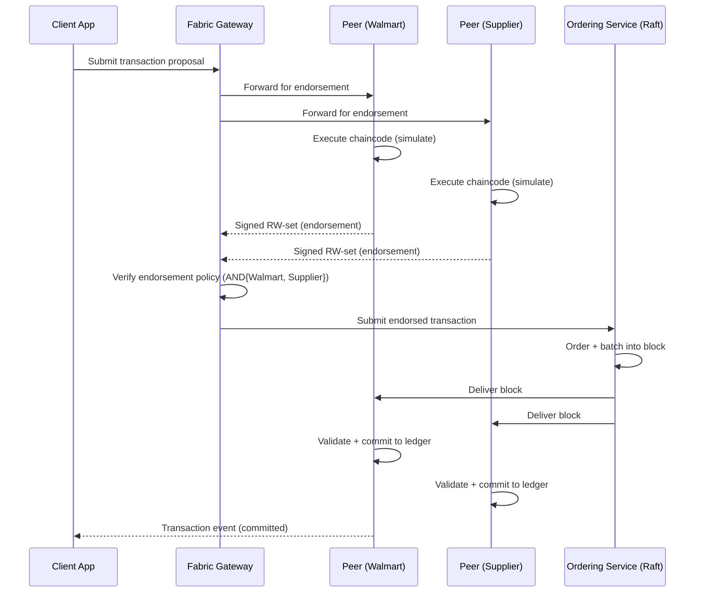
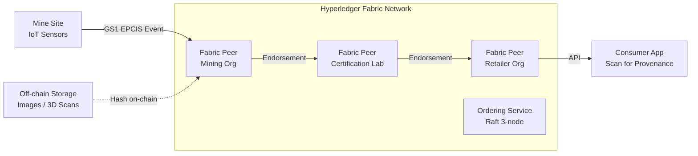
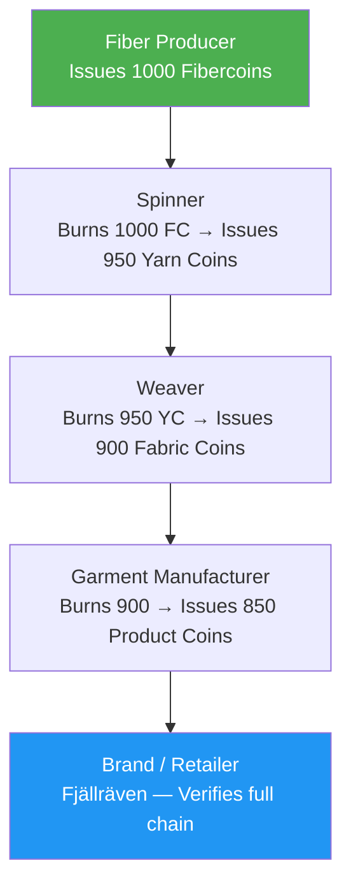
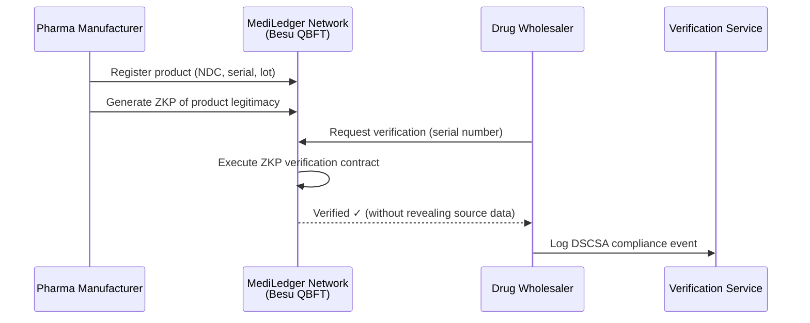
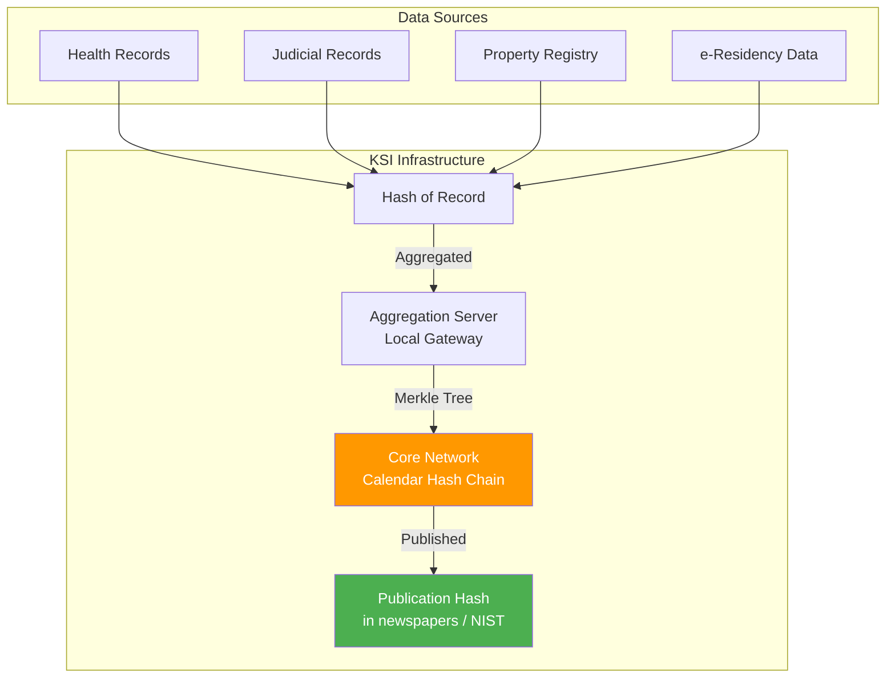
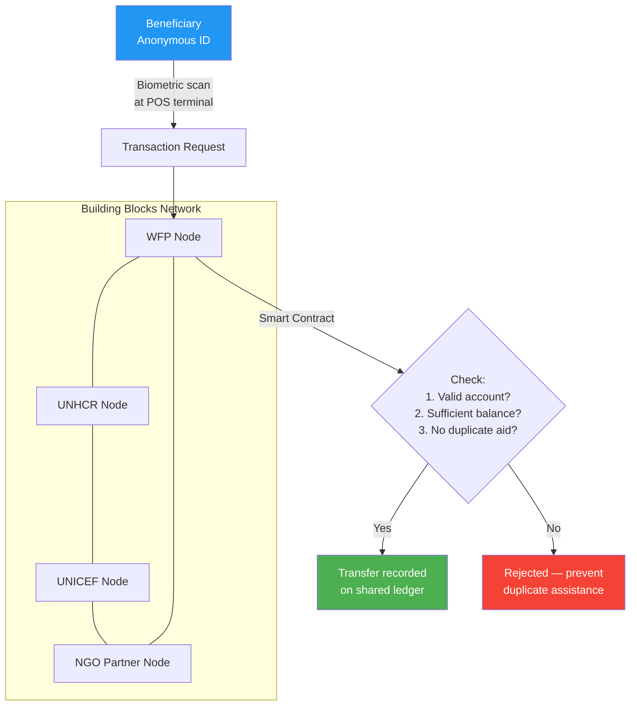
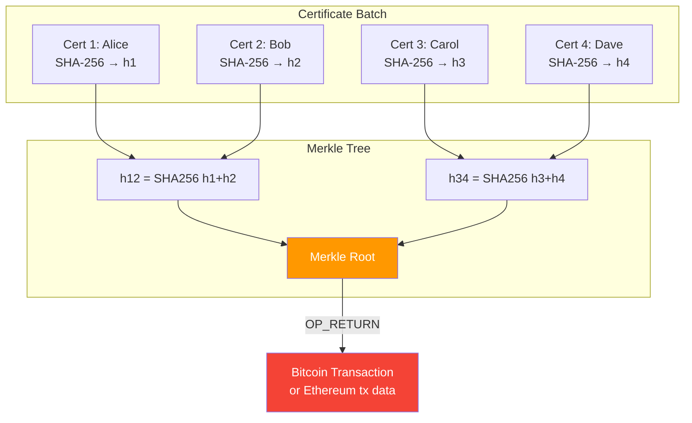
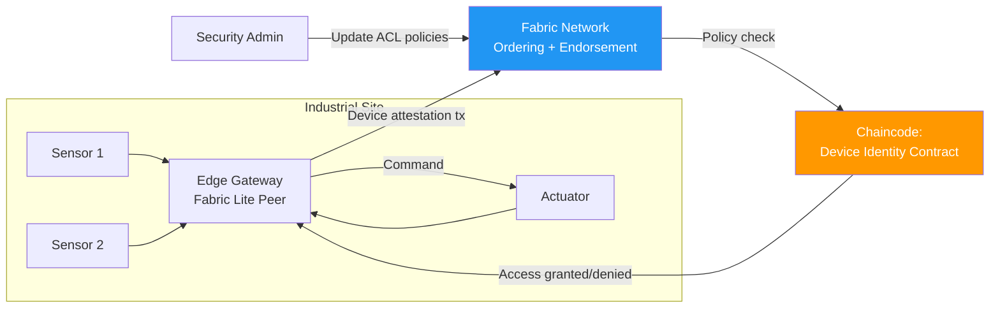
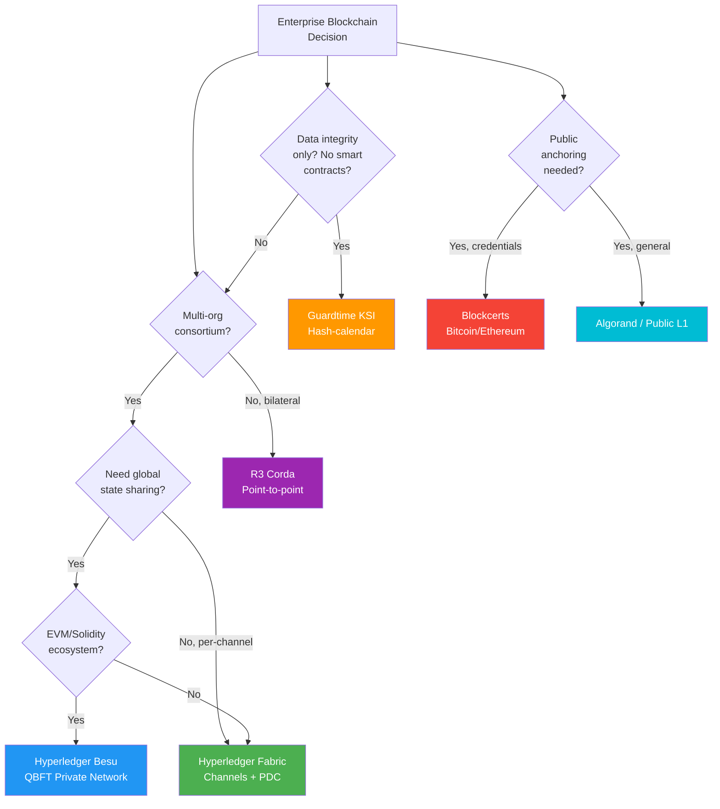

# Enterprise Blockchain: Technical Research & Real-World Implementations

> **Audience**: Blockchain engineers, solution architects, and platform developers.
> **Last updated**: March 2026 — covers production deployments, protocol internals, and infrastructure patterns across permissioned and hybrid networks.

---

## Table of Contents

- [1. Protocol & Platform Reference Matrix](#1-protocol--platform-reference-matrix)
- [2. Supply Chain & Logistics](#2-supply-chain--logistics)
  - [2.1 IBM Food Trust (Hyperledger Fabric)](#21-ibm-food-trust--hyperledger-fabric)
  - [2.2 Everledger Origin (Hyperledger Fabric)](#22-everledger-origin--hyperledger-fabric)
  - [2.3 Aura Consortium (Ethereum / ConsenSys Quorum)](#23-aura-consortium--ethereum--consensys-quorum)
  - [2.4 TextileGenesis (Hyperledger Fabric)](#24-textilegenesis--hyperledger-fabric)
  - [2.5 De Beers Tracr (Ethereum-derived)](#25-de-beers-tracr--ethereum-derived)
- [3. Healthcare](#3-healthcare)
  - [3.1 MediLedger (Enterprise Ethereum / Hyperledger Besu)](#31-mediledger--enterprise-ethereum--hyperledger-besu)
  - [3.2 ProCredEx (R3 Corda)](#32-procredex--r3-corda)
  - [3.3 BurstIQ (Custom Blockchain)](#33-burstiq--custom-blockchain)
- [4. Government, Public Services & Identity](#4-government-public-services--identity)
  - [4.1 Estonia KSI Blockchain (Guardtime)](#41-estonia-ksi-blockchain--guardtime)
  - [4.2 Dubai / UAE Blockchain Strategy](#42-dubai--uae-blockchain-strategy)
- [5. Humanitarian Aid](#5-humanitarian-aid)
  - [5.1 WFP Building Blocks (Ethereum-based Permissioned)](#51-wfp-building-blocks--ethereum-based-permissioned)
- [6. Education & Digital Credentials](#6-education--digital-credentials)
  - [6.1 MIT Blockcerts (Bitcoin / Ethereum)](#61-mit-blockcerts--bitcoin--ethereum)
- [7. IoT & Cybersecurity](#7-iot--cybersecurity)
  - [7.1 Xage Security (Fabric-based)](#71-xage-security--fabric-based)
- [8. Cross-Platform Comparison](#8-cross-platform-comparison)

---

## 1. Protocol & Platform Reference Matrix

| Platform                 | Data Model                          | Consensus (Default)           | Smart Contract Language       | Privacy Model                       | Tx Finality               |
| ------------------------ | ----------------------------------- | ----------------------------- | ----------------------------- | ----------------------------------- | ------------------------- |
| **Hyperledger Fabric**   | Key-Value (World State) + Block log | Raft (CFT) / SmartBFT         | Go, Node.js, Java (Chaincode) | Channels + Private Data Collections | Deterministic (immediate) |
| **Hyperledger Besu**     | Account-based (EVM)                 | QBFT (BFT), IBFT 2.0          | Solidity, Vyper               | Privacy Groups (Tessera)            | Deterministic in PoA      |
| **R3 Corda**             | UTXO-like (States)                  | Notary (pluggable: Raft, BFT) | Kotlin, Java (CorDapps)       | Point-to-point (need-to-know)       | Notary-finalized          |
| **Guardtime KSI**        | Hash-chain (Merkle calendar)        | Custom hash-calendar          | N/A (data integrity layer)    | Off-chain data, on-chain hashes     | Mathematically provable   |
| **Algorand**             | Account-based                       | Pure Proof of Stake (PPoS)    | TEAL / PyTeal / ARC-4         | Public (layer-2 for privacy)        | Instant (~3.3s)           |
| **Bitcoin (Blockcerts)** | UTXO                                | Proof of Work (Nakamoto)      | Script (OP_RETURN)            | Pseudonymous                        | Probabilistic (~6 blocks) |

### Key References

| Platform           | Documentation                                                                 | GitHub                                                                | Community                                                                |
| ------------------ | ----------------------------------------------------------------------------- | --------------------------------------------------------------------- | ------------------------------------------------------------------------ |
| Hyperledger Fabric | [fabric.readthedocs.io](https://hyperledger-fabric.readthedocs.io/en/latest/) | [hyperledger/fabric](https://github.com/hyperledger/fabric)           | [Discord](https://discord.com/invite/hyperledger)                        |
| Hyperledger Besu   | [besu.hyperledger.org](https://besu.hyperledger.org/)                         | [hyperledger/besu](https://github.com/hyperledger/besu/)              | [Discord](https://discord.gg/hyperledger)                                |
| R3 Corda           | [docs.r3.com](https://docs.r3.com/en/platform/corda/4.12/community.html)      | [corda/corda-runtime-os](https://github.com/corda/corda-runtime-os)   | [Slack](https://join.slack.com/t/cordaledger/shared_invite/zt-1t1dsbs9z) |
| Algorand           | [developer.algorand.org](https://developer.algorand.org/docs/)                | [algorand/go-algorand](https://github.com/algorand/go-algorand)       | [Discord](https://discord.gg/algorand)                                   |
| Blockcerts         | [blockcerts.org](https://www.blockcerts.org/)                                 | [blockchain-certificates](https://github.com/blockchain-certificates) | [Forum](http://community.blockcerts.org/)                                |

---

## 2. Supply Chain & Logistics

### 2.1 IBM Food Trust — Hyperledger Fabric

**Protocol**: Hyperledger Fabric v2.x
**Why Fabric**: The execute-order-validate architecture separates transaction endorsement from ordering, avoiding the bottleneck of traditional order-execute models. Fabric's **channel** architecture allows competing retailers (Walmart, Nestlé, Unilever) to share food-safety data without exposing proprietary supply chain details to each other.

#### Technical Architecture

```
┌──────────────────────────────────────────────────────────────┐
│                    IBM Food Trust Network                     │
│                                                              │
│  ┌─────────────┐  ┌─────────────┐  ┌─────────────┐          │
│  │  Walmart Org │  │  Nestlé Org │  │ Unilever Org│          │
│  │  Peer + CA   │  │  Peer + CA  │  │  Peer + CA  │          │
│  └──────┬───────┘  └──────┬──────┘  └──────┬──────┘          │
│         │                 │                 │                │
│  ┌──────▼─────────────────▼─────────────────▼──────┐         │
│  │              Channel: food-trace                 │         │
│  │  ┌──────────────────────────────────┐            │         │
│  │  │  Chaincode: FoodTraceContract    │            │         │
│  │  │  - createProduct()               │            │         │
│  │  │  - recordShipment()              │            │         │
│  │  │  - updateLocation()              │            │         │
│  │  │  - traceOrigin()                 │            │         │
│  │  └──────────────────────────────────┘            │         │
│  └──────────────────────────────────────────────────┘         │
│                                                              │
│  ┌──────────────────────────────────────────────────┐         │
│  │         Raft Ordering Service (5 nodes)          │         │
│  │         BatchTimeout: 2s | BatchSize: 50         │         │
│  └──────────────────────────────────────────────────┘         │
└──────────────────────────────────────────────────────────────┘
```

#### Consensus: Why Raft

Fabric's ordering service uses **Raft** (Crash Fault Tolerant) consensus by default. In a consortium of known, trusted enterprises, CFT is sufficient — Byzantine tolerance is unnecessary when all parties are legally bound. Raft provides:

- **Leader-follower model**: One ordering node is elected leader per channel; followers replicate the log deterministically.
- **Quorum**: Requires majority (e.g., 3 of 5 nodes). Can sustain loss of `(n-1)/2` nodes.
- **Channel-level isolation**: Each channel runs a separate Raft instance, so a leader failure on one channel doesn't affect others.
- **As of Fabric v3.0**, **SmartBFT** is available for networks requiring Byzantine fault tolerance (withstands `< n/3` malicious nodes).

> **Reference**: [The Ordering Service — Fabric Docs](https://hyperledger-fabric.readthedocs.io/en/latest/orderer/ordering_service.html)

#### Transaction Flow (Execute-Order-Validate)



#### Data Model: World State + Block Log

Fabric uses a **key-value world state** (backed by LevelDB or CouchDB) for current asset state, and an **immutable block log** for the full transaction history. This is **not** a UTXO model — it is closer to an account/document model where chaincode reads/writes key-value pairs.

```
World State (CouchDB):
┌─────────────┬───────────────────────────────────────────────┐
│ Key         │ Value (JSON)                                  │
├─────────────┼───────────────────────────────────────────────┤
│ MANGO_001   │ { "origin": "Mexico", "farm": "Rancho Sol",  │
│             │   "harvestDate": "2025-11-02",                │
│             │   "gtin": "00614141000012",                   │
│             │   "status": "IN_TRANSIT",                     │
│             │   "temperature": "4°C",                       │
│             │   "certifications": ["USDA_Organic"] }        │
├─────────────┼───────────────────────────────────────────────┤
│ MANGO_002   │ { "origin": "Honduras", ... }                 │
└─────────────┴───────────────────────────────────────────────┘
```

#### Chaincode Implementation (Node.js — Asset Tracing)

```javascript
// SPDX-License-Identifier: Apache-2.0
// Hyperledger Fabric Chaincode — Food Trace Contract
"use strict";

const { Contract } = require("fabric-contract-api");

class FoodTraceContract extends Contract {
  async CreateProduct(ctx, gtin, origin, farm, harvestDate) {
    const product = {
      docType: "product",
      gtin,
      origin,
      farm,
      harvestDate,
      status: "HARVESTED",
      events: [],
      timestamp: ctx.stub.getTxTimestamp().seconds.low,
    };

    // Endorsement policy: AND('WalmartMSP.peer', 'SupplierMSP.peer')
    await ctx.stub.putState(gtin, Buffer.from(JSON.stringify(product)));

    // Emit event for downstream consumers
    ctx.stub.setEvent(
      "ProductCreated",
      Buffer.from(
        JSON.stringify({
          gtin,
          origin,
          farm,
        }),
      ),
    );

    return JSON.stringify(product);
  }

  async RecordShipment(ctx, gtin, carrier, temperature, location) {
    const productJSON = await ctx.stub.getState(gtin);
    if (!productJSON || productJSON.length === 0) {
      throw new Error(`Product ${gtin} does not exist`);
    }

    const product = JSON.parse(productJSON.toString());
    product.status = "IN_TRANSIT";
    product.events.push({
      type: "SHIPMENT",
      carrier,
      temperature,
      location,
      timestamp: ctx.stub.getTxTimestamp().seconds.low,
      txId: ctx.stub.getTxID(),
    });

    await ctx.stub.putState(gtin, Buffer.from(JSON.stringify(product)));
    return JSON.stringify(product);
  }

  async TraceOrigin(ctx, gtin) {
    // Rich query using CouchDB (JSON query)
    const product = await ctx.stub.getState(gtin);
    if (!product || product.length === 0) {
      throw new Error(`Product ${gtin} does not exist`);
    }

    // Return full history using getHistoryForKey
    const history = [];
    const iterator = await ctx.stub.getHistoryForKey(gtin);
    let result = await iterator.next();

    while (!result.done) {
      const record = {
        txId: result.value.txId,
        timestamp: result.value.timestamp,
        isDelete: result.value.isDelete,
        value: JSON.parse(result.value.value.toString("utf8")),
      };
      history.push(record);
      result = await iterator.next();
    }
    await iterator.close();

    return JSON.stringify(history);
  }

  // Private Data Collection — share sensitive pricing only between
  // Walmart and a specific supplier (not all channel members)
  async SetPrivatePricing(ctx, gtin, price) {
    const transientData = ctx.stub.getTransient();
    const priceData = transientData.get("price");

    // Stored in private data collection (off-chain from other orgs)
    await ctx.stub.putPrivateData(
      "WalmartSupplierPrivateCollection",
      `${gtin}_price`,
      priceData,
    );
  }
}

module.exports = FoodTraceContract;
```

> **Source**: Based on [fabric-samples/asset-transfer-basic](https://github.com/hyperledger/fabric-samples/blob/main/asset-transfer-basic/chaincode-javascript/lib/assetTransfer.js)

#### Private Data Collections

Fabric **Private Data Collections** allow subsets of channel members to share confidential data (e.g., pricing, margins) without exposing it to all channel members. Only a hash of the private data is committed on-chain for verification.

```yaml
# collections_config.json
[
  {
    "name": "WalmartSupplierPrivateCollection",
    "policy": "OR('WalmartMSP.member', 'SupplierMSP.member')",
    "requiredPeerCount": 1,
    "maxPeerCount": 3,
    "blockToLive": 0,
    "memberOnlyRead": true,
    "memberOnlyWrite": true,
  },
]
```

#### Infrastructure

- **Cloud**: IBM Cloud (IBM Blockchain Platform as managed service), also deployable on AWS/Azure/GCP via Kubernetes.
- **Container Orchestration**: Kubernetes with Helm charts for peer/orderer/CA deployment.
- **State DB**: CouchDB (for rich JSON queries) or LevelDB (for key-based lookups).
- **CA**: Fabric CA for MSP enrollment and TLS certificates.
- **GS1 Integration**: EPCIS 2.0 standard events mapped to chaincode transactions.

#### Key Outcomes

- Mango provenance traced in **2.2 seconds** vs ~7 days manually (2016 pilot).
- 25+ products tracked across Walmart, Sam's Club, and global supplier networks.
- GS1 EPCIS standard integration for multi-party interoperability.

#### References

| Resource                | Link                                                                                                       |
| ----------------------- | ---------------------------------------------------------------------------------------------------------- |
| Fabric Documentation    | [hyperledger-fabric.readthedocs.io](https://hyperledger-fabric.readthedocs.io/en/latest/)                  |
| Fabric Samples (GitHub) | [hyperledger/fabric-samples](https://github.com/hyperledger/fabric-samples)                                |
| Transaction Flow        | [Fabric Tx Flow](https://hyperledger-fabric.readthedocs.io/en/latest/txflow.html)                          |
| Private Data            | [Private Data Arch](https://hyperledger-fabric.readthedocs.io/en/latest/private-data-arch.html)            |
| Ordering Service        | [Ordering Service Docs](https://hyperledger-fabric.readthedocs.io/en/latest/orderer/ordering_service.html) |
| Raft Protocol Paper     | [raft.github.io](https://raft.github.io/raft.pdf)                                                          |
| SmartBFT Paper          | [arXiv:2107.06922](https://arxiv.org/abs/2107.06922)                                                       |
| Fabric Gateway          | [Gateway Docs](https://hyperledger-fabric.readthedocs.io/en/latest/gateway.html)                           |

---

### 2.2 Everledger Origin — Hyperledger Fabric

**Protocol**: Hyperledger Fabric
**Use Case**: Diamond digital twins (mine-to-retail provenance, ethical sourcing).

#### Technical Motivation

Diamonds require a unique **identity fingerprint** — Everledger registers 40+ metadata attributes per stone (carat, cut, clarity, color, laser inscription, plus origin mine and custody chain). Using Fabric channels, different supply-chain participants (miners, cutters, certifiers, retailers) share only the data relevant to their role.

#### Architecture Pattern: Digital Twin + IoT Integration



#### Chaincode Pattern — Multi-Attribute Asset (Go)

```go
// Everledger-style diamond asset (Go chaincode)
package main

import (
    "encoding/json"
    "fmt"
    "github.com/hyperledger/fabric-contract-api-go/contractapi"
)

type DiamondContract struct {
    contractapi.Contract
}

type Diamond struct {
    DocType        string   `json:"docType"`
    ID             string   `json:"id"`
    Carat          float64  `json:"carat"`
    Cut            string   `json:"cut"`
    Clarity        string   `json:"clarity"`
    Color          string   `json:"color"`
    Origin         string   `json:"origin"`
    MineID         string   `json:"mineId"`
    LaserInscript  string   `json:"laserInscription"`
    CertBody       string   `json:"certificationBody"`
    CustodyChain   []Event  `json:"custodyChain"`
    ImageHash      string   `json:"imageHash"` // SHA-256 of off-chain 3D scan
    Ethical        bool     `json:"ethicalSource"`
}

type Event struct {
    Actor     string `json:"actor"`
    Action    string `json:"action"`
    Location  string `json:"location"`
    Timestamp int64  `json:"timestamp"`
    TxID      string `json:"txId"`
}

func (c *DiamondContract) RegisterDiamond(ctx contractapi.TransactionContextInterface,
    id string, carat float64, cut, clarity, color, origin, mineID, certBody, imageHash string) error {

    diamond := Diamond{
        DocType:   "diamond",
        ID:        id,
        Carat:     carat,
        Cut:       cut,
        Clarity:   clarity,
        Color:     color,
        Origin:    origin,
        MineID:    mineID,
        CertBody:  certBody,
        ImageHash: imageHash,
        Ethical:   true,
        CustodyChain: []Event{{
            Actor:     "mine",
            Action:    "EXTRACTED",
            Location:  origin,
            Timestamp: ctx.GetStub().GetTxTimestamp().Seconds,
            TxID:      ctx.GetStub().GetTxID(),
        }},
    }

    diamondJSON, err := json.Marshal(diamond)
    if err != nil {
        return fmt.Errorf("failed to marshal diamond: %v", err)
    }

    return ctx.GetStub().PutState(id, diamondJSON)
}

func (c *DiamondContract) TransferCustody(ctx contractapi.TransactionContextInterface,
    id, newActor, action, location string) error {

    diamondJSON, err := ctx.GetStub().GetState(id)
    if err != nil || diamondJSON == nil {
        return fmt.Errorf("diamond %s not found", id)
    }

    var diamond Diamond
    json.Unmarshal(diamondJSON, &diamond)

    diamond.CustodyChain = append(diamond.CustodyChain, Event{
        Actor:     newActor,
        Action:    action,
        Location:  location,
        Timestamp: ctx.GetStub().GetTxTimestamp().Seconds,
        TxID:      ctx.GetStub().GetTxID(),
    })

    updated, _ := json.Marshal(diamond)
    return ctx.GetStub().PutState(id, updated)
}
```

#### References

| Resource               | Link                                                                            |
| ---------------------- | ------------------------------------------------------------------------------- |
| Everledger Platform    | [everledger.io](https://everledger.io/)                                         |
| Fabric Go Contract API | [fabric-contract-api-go](https://github.com/hyperledger/fabric-contract-api-go) |
| GS1 EPCIS Standard     | [gs1.org/epcis](https://www.gs1.org/standards/epcis)                            |

---

### 2.3 Aura Consortium — Ethereum / ConsenSys Quorum

**Protocol**: Ethereum-based permissioned network (ConsenSys Quorum / Hyperledger Besu)
**Consortium Members**: LVMH, Prada Group, OTB Group, Cartier (Richemont)
**Use Case**: Digital certificates of authenticity for luxury goods.

#### Technical Motivation: Why Ethereum-Based

Luxury brands chose an EVM-compatible platform because:

1. **NFT-like digital certificates**: ERC-721-style token per product, representing a unique certificate of authenticity.
2. **Account-based model**: Natural fit for ownership transfer semantics (account A → account B).
3. **Solidity ecosystem**: Mature tooling (Hardhat, OpenZeppelin, Ethers.js).
4. **QBFT Consensus**: Byzantine fault tolerant (2/3+ validators must agree), suitable for a consortium where members may not fully trust each other.

#### QBFT Consensus (Quorum Byzantine Fault Tolerance)

QBFT is the recommended PoA consensus for Hyperledger Besu private networks. It provides:

- **BFT Guarantee**: Tolerates `< n/3` faulty/malicious validators.
- **Deterministic Finality**: Blocks are final once 2/3+ validators sign.
- **Round-Robin Block Proposer**: Each validator takes turns proposing blocks.
- **Configurable block time**: Typically 2-5 seconds for enterprise networks.

```json
// QBFT Genesis configuration (Hyperledger Besu)
{
  "config": {
    "chainId": 2025,
    "berlinBlock": 0,
    "qbft": {
      "epochlength": 30000,
      "blockperiodseconds": 5,
      "requesttimeoutseconds": 10
    }
  },
  "nonce": "0x0",
  "timestamp": "0x5b3d92d7",
  "gasLimit": "0x29b92700",
  "difficulty": "0x1",
  "mixHash": "0x63746963616c2062797a616e74696e65206661756c7420746f6c6572616e6365"
}
```

#### Smart Contract Pattern — Product Authentication (Solidity)

```solidity
// SPDX-License-Identifier: MIT
pragma solidity ^0.8.20;

import "@openzeppelin/contracts/token/ERC721/ERC721.sol";
import "@openzeppelin/contracts/access/AccessControl.sol";

/**
 * @title LuxuryProductCertificate
 * @dev ERC-721 certificate of authenticity for luxury goods.
 *      Deployed on a permissioned Besu/Quorum network (QBFT consensus).
 */
contract LuxuryProductCertificate is ERC721, AccessControl {
    bytes32 public constant BRAND_ROLE = keccak256("BRAND_ROLE");

    struct ProductCertificate {
        string brand;
        string model;
        string serialNumber;
        uint256 manufactureDate;
        string materialOrigin;
        string ipfsMetadataHash; // off-chain: images, 3D model, docs
        bool isAuthentic;
    }

    mapping(uint256 => ProductCertificate) public certificates;
    mapping(uint256 => address[]) public ownershipHistory;

    event CertificateIssued(uint256 indexed tokenId, string brand, string serialNumber);
    event OwnershipTransferred(uint256 indexed tokenId, address from, address to);

    constructor() ERC721("AuraCertificate", "AURA") {
        _grantRole(DEFAULT_ADMIN_ROLE, msg.sender);
    }

    function issueCertificate(
        uint256 tokenId,
        address firstOwner,
        string calldata brand,
        string calldata model,
        string calldata serialNumber,
        string calldata materialOrigin,
        string calldata ipfsHash
    ) external onlyRole(BRAND_ROLE) {
        certificates[tokenId] = ProductCertificate({
            brand: brand,
            model: model,
            serialNumber: serialNumber,
            manufactureDate: block.timestamp,
            materialOrigin: materialOrigin,
            ipfsMetadataHash: ipfsHash,
            isAuthentic: true
        });

        _mint(firstOwner, tokenId);
        ownershipHistory[tokenId].push(firstOwner);
        emit CertificateIssued(tokenId, brand, serialNumber);
    }

    function transferFrom(address from, address to, uint256 tokenId)
        public override {
        super.transferFrom(from, to, tokenId);
        ownershipHistory[tokenId].push(to);
        emit OwnershipTransferred(tokenId, from, to);
    }

    function getOwnershipHistory(uint256 tokenId)
        external view returns (address[] memory) {
        return ownershipHistory[tokenId];
    }

    function verifyCertificate(uint256 tokenId)
        external view returns (ProductCertificate memory) {
        require(_ownerOf(tokenId) != address(0), "Token does not exist");
        return certificates[tokenId];
    }

    function supportsInterface(bytes4 interfaceId)
        public view override(ERC721, AccessControl)
        returns (bool) {
        return super.supportsInterface(interfaceId);
    }
}
```

#### Infrastructure (Besu Private Network)

```bash
# Start a 4-validator QBFT network using Besu
besu --data-path=data \
     --genesis-file=qbft-genesis.json \
     --rpc-http-enabled \
     --rpc-http-api=ETH,NET,QBFT,WEB3 \
     --rpc-http-cors-origins="*" \
     --host-allowlist="*" \
     --min-gas-price=0 \
     --p2p-port=30303
```

#### References

| Resource                   | Link                                                                                       |
| -------------------------- | ------------------------------------------------------------------------------------------ |
| Aura Blockchain Consortium | [auraluxuryblockchain.com](https://auraluxuryblockchain.com/)                              |
| Hyperledger Besu Docs      | [besu.hyperledger.org](https://besu.hyperledger.org/)                                      |
| Besu GitHub                | [hyperledger/besu](https://github.com/hyperledger/besu/)                                   |
| QBFT Consensus Config      | [QBFT Docs](https://besu.hyperledger.org/private-networks/how-to/configure/consensus/qbft) |
| Besu Private Networks      | [Private Networks](https://besu.hyperledger.org/private-networks)                          |
| OpenZeppelin Contracts     | [openzeppelin.com/contracts](https://www.openzeppelin.com/contracts)                       |
| ConsenSys                  | [consensys.io](https://consensys.io/)                                                      |

---

### 2.4 TextileGenesis — Hyperledger Fabric

**Protocol**: Hyperledger Fabric
**Use Case**: Fiber-to-retail traceability (Fibercoin™ token system).

#### Technical Pattern: Token-Based Supply Chain Tracking

TextileGenesis uses a **Fibercoin™** model where tokens represent raw fiber quantities. As fiber moves through spinning, weaving, dyeing, and garment manufacturing, Fibercoins are transferred and split — creating an auditable chain from raw material to finished product.



This approach makes **mass-balance accounting** transparent and auditable: if a supplier claims organic cotton, the Fibercoin trail must trace back to certified organic fiber producers.

#### References

| Resource                  | Link                                                                                                  |
| ------------------------- | ----------------------------------------------------------------------------------------------------- |
| TextileGenesis Platform   | [textilegenesis.com](https://textilegenesis.com/)                                                     |
| Fjällräven Sustainability | [fjallraven.com/sustainability](https://www.fjallraven.com/us/en-us/about-fjallraven/sustainability/) |

---

### 2.5 De Beers Tracr — Ethereum-derived

**Protocol**: Custom Ethereum-derived private blockchain
**Use Case**: Diamond provenance from mine to retail at industry scale.

#### Technical Details

Tracr assigns each diamond a **unique digital identity** at the point of extraction. The platform uses an account-based model with privacy layers for commercial sensitivity. The diamond's physical attributes (4Cs + physical measurements) serve as an immutable fingerprint.

#### References

| Resource       | Link                                |
| -------------- | ----------------------------------- |
| Tracr Platform | [tracr.com](https://www.tracr.com/) |

---

## 3. Healthcare

### 3.1 MediLedger — Enterprise Ethereum / Hyperledger Besu

**Protocol**: Ethereum-based permissioned network (evolved from Parity/Quorum to Hyperledger Besu)
**Use Case**: Pharmaceutical supply chain compliance with the U.S. Drug Supply Chain Security Act (DSCSA).

#### Technical Motivation

MediLedger chose an EVM-based platform for:

1. **Zero-Knowledge Proofs (ZKPs)**: Verify drug authenticity and legitimacy without revealing proprietary business data. Each participant can prove a product is genuine without exposing pricing, quantities, or routing.
2. **Intercompany messaging**: Smart contracts serve as a shared business rules engine between pharma manufacturers, wholesalers, and dispensers.
3. **Account-based model**: Natural for tracking organizational permissions and contract states.

#### Architecture Pattern: ZKP-Enabled Verification



#### References

| Resource           | Link                                                                                                        |
| ------------------ | ----------------------------------------------------------------------------------------------------------- |
| MediLedger Network | [mediledger.com](https://www.mediledger.com/)                                                               |
| DSCSA Requirements | [fda.gov/dscsa](https://www.fda.gov/drugs/drug-supply-chain-integrity/drug-supply-chain-security-act-dscsa) |
| Hyperledger Besu   | [besu.hyperledger.org](https://besu.hyperledger.org/)                                                       |

---

### 3.2 ProCredEx — R3 Corda

**Protocol**: R3 Corda (v4.x)
**Use Case**: Medical credential verification and exchange.

#### Technical Motivation: Why Corda

Corda was selected because of its **UTXO-like state model** and **need-to-know privacy**:

1. **UTXO-like States**: In Corda, data is represented as **states** that are consumed and created (similar to Bitcoin's UTXO model). A credential state is "consumed" when updated and a new state is created. This provides a clear audit trail without requiring a shared global ledger.
2. **Need-to-know privacy**: Unlike Fabric channels (which share all data within a channel), Corda transactions are shared **only with involved parties**. A hospital verifying a doctor's credential never sees other hospitals' verification data.
3. **Notary consensus**: Instead of network-wide consensus, Corda uses **notaries** that only validate uniqueness (no double-spend) without seeing transaction content.

#### Corda State Model

```
┌──────────────────────────────────────────────────────┐
│  Corda UTXO-like State Model                         │
│                                                      │
│  State 0 (Unconsumed):                               │
│  ┌────────────────────────────────────────┐           │
│  │ CredentialState                        │           │
│  │  - practitionerId: "DR-12345"          │           │
│  │  - qualification: "Board Certified"    │           │
│  │  - issuingBody: "ABMS"                 │           │
│  │  - validUntil: 2027-03-01              │           │
│  │  - status: ACTIVE                      │           │
│  │  - linearId: UniqueIdentifier          │           │
│  │  - participants: [Hospital, ABMS]      │           │
│  └────────────────────────────────────────┘           │
│       │                                              │
│       ▼ (Consumed by verification tx)                │
│  ┌────────────────────────────────────────┐           │
│  │ VerificationState                      │           │
│  │  - credentialRef: linearId             │           │
│  │  - verifiedBy: "General Hospital"      │           │
│  │  - verifiedAt: 2026-03-01T10:00:00Z   │           │
│  │  - result: VALID                       │           │
│  └────────────────────────────────────────┘           │
└──────────────────────────────────────────────────────┘
```

#### CorDapp Implementation (Kotlin)

```kotlin
// Corda State — Medical Credential
@BelongsToContract(CredentialContract::class)
data class CredentialState(
    val practitionerId: String,
    val qualification: String,
    val issuingBody: Party,
    val validUntil: Instant,
    val status: CredentialStatus,
    override val linearId: UniqueIdentifier = UniqueIdentifier(),
    override val participants: List<AbstractParty>
) : LinearState

enum class CredentialStatus { ACTIVE, SUSPENDED, REVOKED, EXPIRED }

// Corda Contract — Verification rules
class CredentialContract : Contract {
    companion object {
        const val ID = "com.procredex.contracts.CredentialContract"
    }

    interface Commands : CommandData {
        class Issue : Commands
        class Verify : Commands
        class Revoke : Commands
    }

    override fun verify(tx: LedgerTransaction) {
        val command = tx.commands.requireSingleCommand<Commands>()
        when (command.value) {
            is Commands.Issue -> {
                requireThat {
                    "No inputs should be consumed" using (tx.inputs.isEmpty())
                    "One output state" using (tx.outputs.size == 1)
                    val output = tx.outputsOfType<CredentialState>().single()
                    "Status must be ACTIVE" using (output.status == CredentialStatus.ACTIVE)
                    "Valid date must be in the future" using (output.validUntil > Instant.now())
                    "Issuing body must sign" using
                        (command.signers.contains(output.issuingBody.owningKey))
                }
            }
            is Commands.Verify -> {
                requireThat {
                    "One input credential" using (tx.inputs.size == 1)
                    val input = tx.inputsOfType<CredentialState>().single()
                    "Credential must be ACTIVE" using (input.status == CredentialStatus.ACTIVE)
                    "Credential must not be expired" using (input.validUntil > Instant.now())
                }
            }
            is Commands.Revoke -> {
                val input = tx.inputsOfType<CredentialState>().single()
                val output = tx.outputsOfType<CredentialState>().single()
                requireThat {
                    "Output status must be REVOKED" using
                        (output.status == CredentialStatus.REVOKED)
                    "Issuing body must sign revocation" using
                        (command.signers.contains(input.issuingBody.owningKey))
                }
            }
        }
    }
}

// Corda Flow — Issue Credential
@InitiatingFlow
@StartableByRPC
class IssueCredentialFlow(
    private val practitionerId: String,
    private val qualification: String,
    private val validUntil: Instant,
    private val holder: Party
) : FlowLogic<SignedTransaction>() {

    @Suspendable
    override fun call(): SignedTransaction {
        val notary = serviceHub.networkMapCache.notaryIdentities.first()

        val credentialState = CredentialState(
            practitionerId = practitionerId,
            qualification = qualification,
            issuingBody = ourIdentity,
            validUntil = validUntil,
            status = CredentialStatus.ACTIVE,
            participants = listOf(ourIdentity, holder)
        )

        val txBuilder = TransactionBuilder(notary)
            .addOutputState(credentialState, CredentialContract.ID)
            .addCommand(
                CredentialContract.Commands.Issue(),
                listOf(ourIdentity.owningKey, holder.owningKey)
            )

        txBuilder.verify(serviceHub)
        val partiallySignedTx = serviceHub.signInitialTransaction(txBuilder)
        val session = initiateFlow(holder)
        val fullySignedTx = subFlow(CollectSignaturesFlow(partiallySignedTx, listOf(session)))

        return subFlow(FinalityFlow(fullySignedTx, listOf(session)))
    }
}
```

#### Infrastructure

- **Notary**: Raft-based notary cluster for uniqueness consensus.
- **Node**: JVM-based Corda node per organization.
- **Persistence**: H2 (dev) or PostgreSQL (production) for the vault.
- **Communication**: AMQP/TLS for peer-to-peer messaging.

#### References

| Resource            | Link                                                                                          |
| ------------------- | --------------------------------------------------------------------------------------------- |
| Corda Documentation | [docs.r3.com](https://docs.r3.com/en/platform/corda/4.12/community.html)                      |
| Corda GitHub        | [corda/corda-runtime-os](https://github.com/corda/corda-runtime-os)                           |
| Corda Key Concepts  | [Key Concepts](https://docs.r3.com/en/platform/corda/4.12/community/key-concepts-states.html) |
| Corda Samples       | [corda/samples-kotlin](https://github.com/corda/samples-kotlin)                               |

---

### 3.3 BurstIQ — Custom Blockchain

**Protocol**: Proprietary blockchain (BigChainDB-derived) with HIPAA-compliant data layer
**Use Case**: Patient health data ownership, secure sharing, and analytics.

#### Technical Pattern: Granular Consent Smart Contracts

BurstIQ's "LifeGraph" combines blockchain-secured consent records with off-chain encrypted health data. Patients grant time-limited, purpose-specific access tokens via smart contracts.

#### References

| Resource         | Link                                    |
| ---------------- | --------------------------------------- |
| BurstIQ Platform | [burstiq.com](https://www.burstiq.com/) |

---

## 4. Government, Public Services & Identity

### 4.1 Estonia KSI Blockchain — Guardtime

**Protocol**: KSI (Keyless Signature Infrastructure) by Guardtime
**Deployed**: ~2008 onward, anchoring all Estonian government registries.

#### Technical Architecture: Hash-Calendar Based Integrity

KSI is **not a traditional distributed ledger**. It is a **hash-chain integrity verification system** that provides mathematical proof that data has not been tampered with, without storing the data itself on-chain.



#### How KSI Works (Engineering Perspective)

1. **Hash**: Each data record (health record, property title) is hashed locally. The original data **never leaves the source system**.
2. **Aggregate**: Hashes are sent to KSI gateway servers that build Merkle trees aggregating many hashes into a single root.
3. **Calendar**: The aggregated root is linked into a global **hash calendar** — a sequential chain of hash values, one per second.
4. **Publish**: The calendar root is periodically **published** in physical newspapers and other irrefutable media (e.g., Financial Times), creating an unforgeable timestamp anchor.

#### Key Technical Properties

| Property               | Description                                                                                        |
| ---------------------- | -------------------------------------------------------------------------------------------------- |
| **Keyless**            | No long-lived cryptographic keys needed for verification — removes key management risk.            |
| **Post-quantum ready** | Security relies on hash functions (not RSA/ECC), making it resistant to quantum computing attacks. |
| **O(1) verification**  | Verification time is constant regardless of history length — no need to replay the chain.          |
| **Data privacy**       | Only hashes are on-chain. Full data stays in source systems. GDPR-compliant by design.             |
| **Scale**              | Processes billions of hash operations per second across Estonian government systems.               |

#### Verification Process

```python
# Simplified KSI signature verification concept
# (Not the actual Guardtime SDK — illustrative)

import hashlib

def verify_ksi_signature(record_data: str, ksi_signature: dict) -> bool:
    """
    Verify that a record has not been tampered with since signing.

    KSI signatures contain:
    1. The hash chain path from the record to the calendar root
    2. The publication reference (newspaper, NIST)
    """
    # Step 1: Hash the current record
    current_hash = hashlib.sha256(record_data.encode()).hexdigest()

    # Step 2: Walk the Merkle path in the KSI signature
    computed_root = current_hash
    for sibling_hash, direction in ksi_signature['merkle_path']:
        if direction == 'LEFT':
            computed_root = hashlib.sha256(
                (sibling_hash + computed_root).encode()
            ).hexdigest()
        else:
            computed_root = hashlib.sha256(
                (computed_root + sibling_hash).encode()
            ).hexdigest()

    # Step 3: Compare against the published calendar value
    published_root = ksi_signature['publication_hash']

    return computed_root == published_root
    # If True → data integrity is mathematically proven
    # If False → data has been tampered with
```

#### Infrastructure & Scale

- **Deployed across**: Health records, judicial records, property registry, police operational data, e-Residency.
- **Used by**: NATO, U.S. Department of Defense, UK National Health Service (NHS).
- **Publication media**: Financial Times, Estonian national newspapers.

#### References

| Resource                 | Link                                                                                           |
| ------------------------ | ---------------------------------------------------------------------------------------------- |
| e-Estonia KSI Blockchain | [e-estonia.com/ksi-blockchain](https://e-estonia.com/solutions/cyber-security/ksi-blockchain/) |
| Guardtime                | [guardtime.com](https://guardtime.com/)                                                        |
| KSI Technology Paper     | [Guardtime KSI Whitepaper](https://guardtime.com/technology)                                   |
| e-Estonia Platform       | [e-estonia.com](https://e-estonia.com/)                                                        |

---

### 4.2 Dubai / UAE Blockchain Strategy

**Protocol**: Hyperledger Fabric and Ethereum-based (multi-platform strategy)
**Use Case**: Paperless government — all government documents on blockchain by 2025 target.

#### Technical Components

- **UAE Pass**: National digital identity using blockchain-anchored credentials.
- **Health licensing**: Real-time credential verification for medical professionals.
- **Trade & Customs**: Based on former TradeLens patterns (Fabric), now evolved into national supply chain platforms.

#### Key Metrics

- Estimated savings of **AED 5.5 billion** (~USD 1.5B) annually from reduced paperwork and verification time.
- Document verification in **< 5 minutes** via biometric + blockchain combination.

#### References

| Resource                | Link                                                                             |
| ----------------------- | -------------------------------------------------------------------------------- |
| Smart Dubai             | [smartdubai.ae](https://www.smartdubai.ae/)                                      |
| UAE Blockchain Strategy | [government.ae](https://u.ae/en/about-the-uae/digital-uae/blockchain-in-the-uae) |

---

## 5. Humanitarian Aid

### 5.1 WFP Building Blocks — Ethereum-based Permissioned

**Protocol**: Permissioned Ethereum network (private fork, previously Parity/OpenEthereum, now evolved)
**Use Case**: Humanitarian cash-transfer and aid coordination.

#### Technical Architecture

Building Blocks is a **collection of blockchain nodes** — each participating humanitarian organization operates an independent node. Together they form a permissioned network with no central authority.



#### Privacy Design

- **No PII on-chain**: No names, dates of birth, or biometrics are stored on the blockchain.
- **Anonymous identifiers**: Each beneficiary is represented by an anonymous blockchain account.
- **Biometric link**: Iris scans (via IrisGuard) are used at point-of-sale terminals for authentication but are **not stored on-chain**.

#### Smart Contract Pattern — Aid Disbursement

```solidity
// SPDX-License-Identifier: MIT
pragma solidity ^0.8.20;

/**
 * @title HumanitarianAidLedger
 * @dev Tracks aid disbursement across multiple agencies
 *      on WFP Building Blocks permissioned network.
 */
contract HumanitarianAidLedger {

    struct BeneficiaryRecord {
        bytes32 anonymousId;    // Hashed identifier — no PII
        uint256 allocatedAmount;
        uint256 disbursedAmount;
    }

    mapping(bytes32 => BeneficiaryRecord) private beneficiaries;
    mapping(bytes32 => mapping(address => uint256)) private agencyDisbursements;
    mapping(address => bool) public authorizedAgencies;
    address public admin;

    event AidDisbursed(bytes32 indexed beneficiaryId, address agency, uint256 amount);
    event DuplicateAidPrevented(bytes32 indexed beneficiaryId, address agency);

    modifier onlyAuthorized() {
        require(authorizedAgencies[msg.sender], "Not authorized agency");
        _;
    }

    constructor() {
        admin = msg.sender;
    }

    function registerAgency(address agency) external {
        require(msg.sender == admin, "Only admin");
        authorizedAgencies[agency] = true;
    }

    function allocateAid(bytes32 beneficiaryId, uint256 amount) external onlyAuthorized {
        beneficiaries[beneficiaryId].anonymousId = beneficiaryId;
        beneficiaries[beneficiaryId].allocatedAmount += amount;
    }

    function disburseAid(bytes32 beneficiaryId, uint256 amount) external onlyAuthorized {
        BeneficiaryRecord storage b = beneficiaries[beneficiaryId];

        require(
            b.disbursedAmount + amount <= b.allocatedAmount,
            "Exceeds allocation — potential duplicate"
        );

        b.disbursedAmount += amount;
        agencyDisbursements[beneficiaryId][msg.sender] += amount;

        emit AidDisbursed(beneficiaryId, msg.sender, amount);
    }

    function checkDuplicateRisk(bytes32 beneficiaryId)
        external view returns (uint256 allocated, uint256 disbursed, uint256 remaining)
    {
        BeneficiaryRecord storage b = beneficiaries[beneficiaryId];
        return (b.allocatedAmount, b.disbursedAmount, b.allocatedAmount - b.disbursedAmount);
    }
}
```

#### Key Outcomes (as of 2025–2026)

| Metric                                    | Value             |
| ----------------------------------------- | ----------------- |
| People served                             | > 6 million       |
| Transactions processed                    | > 40 million      |
| Value processed                           | > USD 760 million |
| Bank fees saved                           | > USD 3.5 million |
| Duplicate aid prevented (Ukraine + Syria) | > USD 287 million |
| Participating organizations               | 159+              |

#### References

| Resource                                                  | Link                                                                                                                             |
| --------------------------------------------------------- | -------------------------------------------------------------------------------------------------------------------------------- |
| WFP Building Blocks                                       | [innovation.wfp.org/building-blocks](https://innovation.wfp.org/project/building-blocks)                                         |
| WFP Innovation                                            | [innovation.wfp.org](https://innovation.wfp.org/)                                                                                |
| Medium — 3 Ways Blockchain Enhances Humanitarian Response | [Medium Article](https://wfpinnovation.medium.com/3-ways-that-blockchain-innovation-is-enhancing-humanitarian-work-e40dd3e85dee) |
| Blockchain Against Hunger                                 | [WFP Blog](https://innovation.wfp.org/blog/blockchain-against-hunger-harnessing-technology-support-syrian-refugees)              |

---

## 6. Education & Digital Credentials

### 6.1 MIT Blockcerts — Bitcoin / Ethereum

**Protocol**: Bitcoin (OP_RETURN) and Ethereum (primary issuance chains)
**Standard**: [W3C Verifiable Credentials](https://www.w3.org/TR/vc-data-model/) + [MerkleProof2019 Linked Data Signature](https://w3c-ccg.github.io/lds-merkle-proof-2019/)
**Use Case**: Tamper-proof digital diplomas and academic credentials.

#### Technical Architecture: Merkle Proof Anchoring

Blockcerts uses **batch issuance** — multiple certificates are hashed, combined into a Merkle tree, and the Merkle root is anchored to a public blockchain via a single transaction (using Bitcoin's `OP_RETURN` or Ethereum's transaction data field).



#### Data Model: UTXO-Based Anchoring (Bitcoin)

When using Bitcoin, Blockcerts leverages the **UTXO model**:

```
Bitcoin Transaction Structure:
┌───────────────────────────────────────────┐
│  Input:                                   │
│    - UTXO from issuer's Bitcoin address   │
│    - ~$0.80 USD worth of BTC              │
│                                           │
│  Outputs:                                 │
│    1. OP_RETURN: <merkle_root_hash>       │
│       (stores 32-byte Merkle root)        │
│    2. Change output → issuer address      │
└───────────────────────────────────────────┘
```

The `OP_RETURN` output is an **unspendable** output that permanently embeds data into the Bitcoin blockchain. This is a pure data-anchoring pattern — no tokens or value transfer is involved in the credential itself.

#### Verifiable Credential Format (Blockcerts v3)

```json
{
  "@context": [
    "https://www.w3.org/2018/credentials/v1",
    "https://w3id.org/blockcerts/v3"
  ],
  "id": "urn:uuid:bbba8553-8ec1-445f-82c9-a57251dd731c",
  "type": ["VerifiableCredential", "BlockcertsCredential"],
  "issuer": "did:ion:EiA_Z6LQILbB2zj_eVrqfQ2xDm4HNqeJUw5Kj2Z7bFOOeQ",
  "issuanceDate": "2026-01-15T00:00:00Z",
  "credentialSubject": {
    "id": "did:example:ebfeb1f712ebc6f1c276e12ec21",
    "name": "Jane Smith",
    "degree": {
      "type": "MasterDegree",
      "name": "Master of Science in Computer Science",
      "college": "MIT — School of Engineering"
    }
  },
  "proof": {
    "type": "MerkleProof2019",
    "created": "2026-01-15T00:00:00Z",
    "proofValue": "z2LkWs...base58-encoded-merkle-proof",
    "proofPurpose": "assertionMethod",
    "verificationMethod": "did:ion:EiA_Z6LQILbB2zj_eVrqfQ2xDm4HNqeJUw5Kj2Z7bFOOeQ#key-1",
    "anchors": [
      {
        "sourceId": "d75b7a5bdb3d5244b753e6b84e987267cfa4ffa7a532a2ed49ad3848be1d82f8",
        "type": "BTCOpReturn",
        "chain": "bitcoinMainnet"
      }
    ]
  }
}
```

#### Issuance Flow (cert-issuer)

```bash
# Install cert-issuer (Python)
git clone https://github.com/blockchain-certificates/cert-issuer.git
cd cert-issuer
python setup.py install

# Configuration (conf.ini)
cat > conf.ini << 'EOF'
issuing_address = <your-bitcoin-address>
verification_method = did:ion:EiA_Z6LQILbB2zj_eVrqfQ2xDm4HNqeJUw5Kj2Z7bFOOeQ#key-1
chain = bitcoin_mainnet
usb_name = /Volumes/keys/
key_file = pk_issuer.txt
unsigned_certificates_dir = ./data/unsigned_certificates
blockchain_certificates_dir = ./data/blockchain_certificates
work_dir = ./data/work
no_safe_mode
EOF

# Issue certificates (anchors Merkle root to Bitcoin)
cert-issuer -c conf.ini
```

#### DID Integration

Blockcerts v3 uses **Decentralized Identifiers (DIDs)** for issuer identity, enabling verification without relying on centralized domain ownership:

```json
{
  "id": "did:ion:EiA_Z6LQILbB2zj_eVrqfQ2xDm4HNqeJUw5Kj2Z7bFOOeQ",
  "service": [
    {
      "id": "#service-1",
      "type": "IssuerProfile",
      "serviceEndpoint": "https://www.blockcerts.org/samples/3.0/issuer-blockcerts.json"
    }
  ]
}
```

#### References

| Resource                   | Link                                                                                                    |
| -------------------------- | ------------------------------------------------------------------------------------------------------- |
| Blockcerts Standard        | [blockcerts.org](https://www.blockcerts.org/)                                                           |
| cert-issuer (GitHub)       | [blockchain-certificates/cert-issuer](https://github.com/blockchain-certificates/cert-issuer)           |
| cert-verifier-js           | [blockchain-certificates/cert-verifier-js](https://github.com/blockchain-certificates/cert-verifier-js) |
| cert-tools                 | [blockchain-certificates/cert-tools](https://github.com/blockchain-certificates/cert-tools)             |
| W3C Verifiable Credentials | [w3.org/TR/vc-data-model](https://www.w3.org/TR/vc-data-model/)                                         |
| W3C DID Core               | [w3.org/TR/did-core](https://www.w3.org/TR/did-core/)                                                   |
| MerkleProof2019 Spec       | [w3c-ccg.github.io](https://w3c-ccg.github.io/lds-merkle-proof-2019/)                                   |
| DIF Universal Resolver     | [uniresolver.io](https://uniresolver.io/)                                                               |

---

## 7. IoT & Cybersecurity

### 7.1 Xage Security — Fabric-based

**Protocol**: Hyperledger Fabric (with proprietary extensions)
**Use Case**: Multi-factor authentication and tamper-resistant device identity for industrial IoT.

#### Technical Pattern: Decentralized Device Identity



Each device has a blockchain-registered identity. Access control policies are enforced via chaincode — a compromised device is automatically quarantined when its attestation fails.

#### Deployments

- U.S. Air Force
- Microsoft Azure IoT integrations
- Energy & manufacturing critical infrastructure

#### References

| Resource             | Link                                                                                       |
| -------------------- | ------------------------------------------------------------------------------------------ |
| Xage Security        | [xage.com](https://xage.com/)                                                              |
| Fabric IoT Use Cases | [Hyperledger Use Cases](https://hyperledger-fabric.readthedocs.io/en/latest/usecases.html) |

---

## 8. Cross-Platform Comparison

### When to Use What: Decision Framework



### Comparative Architecture Matrix

| Dimension          | Fabric                    | Besu (QBFT)              | Corda                         | KSI                       |
| ------------------ | ------------------------- | ------------------------ | ----------------------------- | ------------------------- |
| **Tx Model**       | Execute-Order-Validate    | Order-Execute (EVM)      | Flow-based point-to-point     | Hash-aggregate-publish    |
| **State**          | Key-value World State     | Account/Storage trie     | UTXO-like vault               | No state (integrity only) |
| **Privacy**        | Channels + PDC            | Privacy Groups (Tessera) | Need-to-know (default)        | Data never on-chain       |
| **Throughput**     | ~3,500 TPS (benchmarked)  | ~800 TPS (QBFT, 4 val.)  | ~1,000 TPS (notary-dependent) | Billions of hashes/sec    |
| **Finality**       | Immediate (deterministic) | Immediate (BFT)          | Notary-finalized              | Mathematical proof        |
| **Smart Contract** | Chaincode (Go/JS/Java)    | Solidity/Vyper (EVM)     | CorDapps (Kotlin/Java)        | N/A                       |
| **Best For**       | Multi-org supply chain    | DeFi-adjacent enterprise | Bilateral agreements          | Data integrity at scale   |

### Challenges & Mitigations

| Challenge              | Engineering Mitigation                                                                                               |
| ---------------------- | -------------------------------------------------------------------------------------------------------------------- |
| **Scalability**        | Fabric channels for horizontal partitioning; Besu layer-2 (Linea); Corda notary clusters.                            |
| **Legacy Integration** | REST/gRPC APIs wrapping chaincode; Corda's JDBC vault for SQL integration; KSI gateway servers for existing systems. |
| **GDPR Compliance**    | Off-chain data + on-chain hash (all platforms); Fabric PDC with `blockToLive` auto-purge; Corda need-to-know.        |
| **HIPAA Compliance**   | BurstIQ consent contracts; encrypted off-chain storage; Fabric private data with ACL.                                |
| **Interoperability**   | Hyperledger Cacti (cross-chain); W3C DID/VC standards; GS1 EPCIS for supply chain.                                   |

---

## Appendix: Quick Start Resources

### Hyperledger Fabric — Local Dev Network

```bash
# Prerequisites: Docker, Docker Compose, Go 1.21+, Node.js 18+

# Clone fabric-samples
git clone https://github.com/hyperledger/fabric-samples.git
cd fabric-samples

# Download Fabric binaries and Docker images
curl -sSLO https://raw.githubusercontent.com/hyperledger/fabric/main/scripts/install-fabric.sh \
  && chmod +x install-fabric.sh
./install-fabric.sh

# Start test network with CouchDB
cd test-network
./network.sh up createChannel -ca -s couchdb

# Deploy chaincode
./network.sh deployCC -ccn basic -ccp ../asset-transfer-basic/chaincode-javascript \
  -ccl javascript

# Interact via peer CLI
export PATH=${PWD}/../bin:$PATH
export FABRIC_CFG_PATH=$PWD/../config/

peer chaincode invoke -o localhost:7050 \
  --ordererTLSHostnameOverride orderer.example.com \
  --tls --cafile "${PWD}/organizations/ordererOrganizations/example.com/orderers/orderer.example.com/msp/tlscacerts/tlsca.example.com-cert.pem" \
  -C mychannel -n basic \
  --peerAddresses localhost:7051 \
  --tlsRootCertFiles "${PWD}/organizations/peerOrganizations/org1.example.com/peers/peer0.org1.example.com/tls/ca.crt" \
  -c '{"function":"CreateAsset","Args":["asset1","blue","5","Tom","1300"]}'
```

### Hyperledger Besu — QBFT Private Network

```bash
# Prerequisites: Java 17+, Docker

# Clone quickstart
git clone https://github.com/ConsenSys/quorum-dev-quickstart.git
cd quorum-dev-quickstart

# Generate QBFT network
npx quorum-dev-quickstart

# Or manual Besu start:
besu --data-path=data \
     --genesis-file=qbft-genesis.json \
     --rpc-http-enabled \
     --rpc-http-api=ETH,NET,QBFT,WEB3 \
     --min-gas-price=0

# Query validators
curl -X POST --data \
  '{"jsonrpc":"2.0","method":"qbft_getValidatorsByBlockNumber","params":["latest"],"id":1}' \
  http://localhost:8545
```

### R3 Corda — CorDapp Development

```bash
# Prerequisites: JDK 17, IntelliJ IDEA

# Clone Corda template
git clone https://github.com/corda/cordapp-template-kotlin.git
cd cordapp-template-kotlin

# Build
./gradlew clean build

# Deploy nodes locally
./gradlew deployNodes

# Start nodes
cd build/nodes
./runnodes
```

---

> **Document maintained by**: Enterprise Blockchain Research
> **Sources**: Hyperledger Foundation, R3, Guardtime, WFP Innovation, Blockcerts Foundation, ConsenSys, e-Estonia.
> **Data period**: 2024–2026, with historical context where noted.
